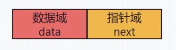

## 链表

### 1. 链表
1. 链表在物理上是非连续、非顺序的数据结构。由一系列节点(node)组成。链表中数据元素的逻辑顺序是通过链表中的指针链接次序实现的。
2. 链表由一系列节点组成，节点可以在运行时动态生成。每个节点包括两个部分：一个是存储数据元素的数据域，另一个是存储下一个节点地址的指针域。



### 链表分类  
1. 单向链表：
    1. 单向链表只有一个方向，第一个节点的存储位置叫做头指针，最后一个节点叫做后继指针，节点只有一个后继指针 next 指向后面的节点。
    2. 链表的最后一个节点的后继指针 next 指向空地址 NULL。
    3. 链表的遍历方式只能是从头指针开始，一直找到后继指针指向的位置是 NULL 时结束。
    4. 头节点：
        1. 头节点的数据域不存储任何数据，通常作为链表的第一个节点。
        2. 头节点的指针域存储指向第一个节点的指针。
        3. 头节点的作用是方便对链表的操作，比如插入节点、删除节点等。
    5. 头指针：
        1. 头指针是指向链表中第一个节点的指针。
        2. 头指针一般存储在头节点中，也可以单独存储。
```
Node{
    int data;
    Node next;
}
```

2. 双向链表：
    1. 双向链表有两个方向，每个节点有两个指针，一个指向前一个节点，一个指向后一个节点。
    2. 第一个节点的前驱指针 prev 指向空地址 NULL，最后一个节点的后继指针 next 指向空地址 NULL。
    3. 链表的遍历方式可以是从头指针开始，一直找到后继指针指向的位置是 NULL 时结束，也可以是从尾指针开始，一直找到前驱指针指向的位置是 NULL 时结束。
    4. 头节点：
        1. 头节点的数据域不存储任何数据，通常作为链表的第一个节点。
        2. 头节点的前驱指针 prev 指向空地址 NULL，后继指针 next 指向第一个节点。
        3. 头节点的作用是方便对链表的操作，比如插入节点、删除节点等。
    5. 头指针：
        1. 头指针是指向链表中第一个节点的指针。
        2. 头指针一般存储在头节点中，也可以单独存储。
    6. 尾指针：
        1. 尾指针是指向链表中最后一个节点的指针。
        2. 尾指针一般存储在头节点中，也可以单独存储。

```
Node{
    int data;
    Node next;
    Node prev;
}
```

3. 循环链表：
    1. 循环链表是一种特殊的链表，最后一个节点的后继指针 next 指向头节点，形成一个环。
    2. 循环链表的遍历方式可以是从头指针开始，一直找到后继指针指向的位置是头指针时结束。
    3. 头节点：
        1. 头节点的数据域不存储任何数据，通常作为链表的第一个节点。
        2. 头节点的后继指针 next 指向第一个节点。
        3. 头节点的作用是方便对链表的操作，比如插入节点、删除节点等。
    4. 头指针：
        1. 头指针是指向链表中第一个节点的指针。
        2. 头指针一般存储在头节点中，也可以单独存储。

### 链表操作

#### 单向链表操作

1. 遍历查找
在查找元素时，链表只能从头节点开始一个个节点查找，直到找到或者查找完整个链表。
2. 插入
在插入元素时，需要先找到要插入位置的前一个节点，然后将新节点的 next 指针指向要插入位置的节点，再将前一个节点的 next 指针指向新节点。
3. 删除
在删除元素时，需要先找到要删除的节点，然后将前一个节点的 next 指针指向要删除节点的下一个节点。

#### 双向链表
1. 遍历查找
- 在双向链表中，遍历查找元素可以有两种方式：
    1. 从头节点开始：从链表的头节点开始，逐个节点向后遍历，直到找到目标元素或者遍历到链表的末尾。
    2. 从尾节点开始：如果链表有尾指针，也可以从尾节点开始向前遍历，直到找到目标元素或者遍历到链表的头部。  

遍历查找的时间复杂度通常是O(n)，其中n是链表中的节点数，因为最坏的情况下可能需要遍历整个链表。

2. 插入
- 双向链表的插入操作可以在链表的任意位置进行，包括头部、尾部以及链表中间的任意节点。以下是插入操作的一些情况：

    1. 在头部插入：创建一个新的节点，将其设置为头节点的前驱，并将头节点设置为新节点的后继。
    2. 在尾部插入：创建一个新的节点，将其设置为尾节点的后继，并将尾节点设置为新节点的前驱。
    3. 在中间插入：找到要插入位置的前一个节点和后一个节点，然后将新节点插入到这两个节点之间，更新相关节点的前驱和后继指针。  
    
插入操作的时间复杂度通常是O(1)，如果已知插入位置的前驱节点，因为只需要修改几个指针。如果需要从头节点开始遍历以找到插入位置，则时间复杂度为O(n)。

