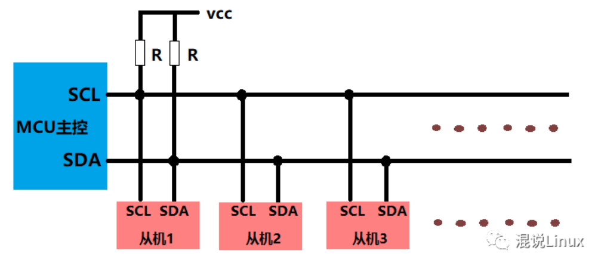

## 简介
IIC是一种两线式总线，由飞利浦公司开发的总线协议。也是属于一主多从的结构。每一个设备都有一个特定的设备地址，来区分设备

IIC有两根线：
- SDA : 串行数据线
- SCL : 串行时钟线

所有的通信都由主机发起，从机被动响应。

## 一般通信过程

### 主机给从机发
1. 主设备发送起始信号(START)
2. 主设备发送设备地址到从设备
3. 等待从设备响应
4. 主设备发送数据，一般发送的每个字节数据会跟着等待接收来自从设备的响应(ACK)
5. 数据发送完毕，主设备发送停止(STOP),终止传输

### 主机从从机那读
1. 设备发起起始信号(START)
2. 主设备发送设备地址到从机
3. 等待从机的响应
4. 主机接收从机的数据，每个数据后面跟一个向从机发送的响应信号
5. 一般接收到最后一个数据后发送一个无效响应，然后主机发送STOP信号

## 为什么IIC总线需要上拉电阻
这与工作原理相关。IIC采用开放漏极或者开集电极的通信方式。在这个模式下，驱动器只能将线拉到低电平，无法将线拉到高电平。
但是SDA和SCL线操作需要拉高拉低，所以就必须要有上拉电阻。且总线在空闲时都是高电平，用上拉电阻正好实现了。
