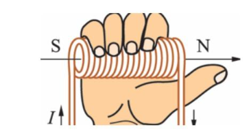
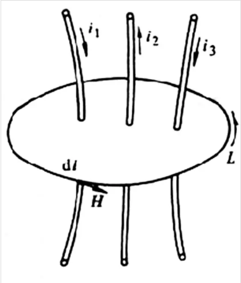

## 概念
### 安培定则(右手螺旋定则)

右手螺旋定则：  
- 假设右手握住通电导线，大拇指指向电流方向，那么弯曲的四指就是导线周围的磁场方向
- 假设用右手握住通电螺线管，弯曲四指指向电流方向，那么大拇指指向就是通电螺线管内部的磁场方向

### 安培环路定律

在稳恒磁场中，磁感应强度B沿任何闭合路径的线积分，等于这个闭合路径所包围的各个电流的代数和乘磁导率。也就是：
$$
\oint_{L}H · dl =  \sum i
$$

其中，H为磁场强度，$\sum i$为闭合回线所包围的电流总和，其中若电流正方向与闭合回线L方向符合右手螺线关系，则i取正号否则i为负。

### 磁链
磁链，描述的是定子绕组和转子磁通之间的关系，通常用$\psi$表示，为线圈匝数N与穿过该线圈各匝的平均磁通量$\varphi$的乘积，即：
$$
\psi = N · \varphi
$$

在电机里，磁链的变化会影响电动势的产生，因而驱动电机旋转，也可以表示为通过线圈的电压对时间的积分。