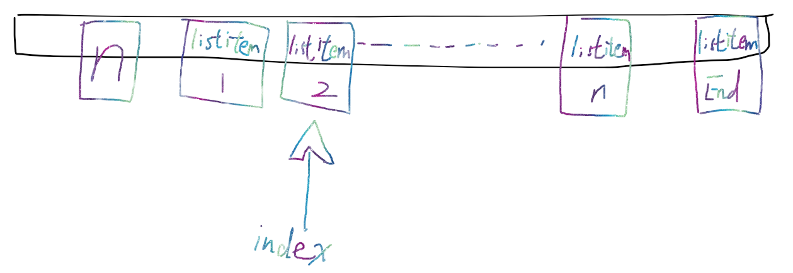

## FreeRTOS 列表

### 定义
在FreeRTOS内核中，有list.c/h，其实使用的是双向链表。
这里有两个概念，一个是列表(List)一个是列表项(ListItem).
可以简单的这样去理解：列表就是一个双向链表，列表项就是链表中的节点。

#### 列表
源码中对列表结构体的定义为：  
```
typedef struct xLIST
{
	volatile UBaseType_t uxNumberOfItems;
	ListItem_t * configLIST_VOLATILE pxIndex;
	MiniListItem_t xListEnd;					
} List_t;
```
其中：  
- uxNumberOfItems：是一个计数器，用于跟踪链表项目中也就是节点的数量
- pxIndex: 指向链表中最后一个插入或删除的节点的指针。
- xListEnd: 是一个 MiniListItem_t 类型的结构体，它是链表的末尾。它是一个迷你链表项，不包含任何实际的数据，只是用于表示链表的末尾。ss

也就是说对于一个列表，下面可以挂很多个列表项，可以简单的理解为一个长条的桌子，上面挂了很多个便签，其中长条的桌子上有一个显示着这个桌子上挂了多少个便签，
还有一个可以移动的指针，指向现在访问着哪个便签，同时还有一个便签，用来表示是最后一个便签。
比如： 


大概就是这个意思。

#### 列表项
列表项就是链表中的节点，源码中对列表项结构体的定义为：

```
struct xLIST;
struct xLIST_ITEM
{
	configLIST_VOLATILE TickType_t xItemValue;

	struct xLIST_ITEM * configLIST_VOLATILE pxNext;	
	
	struct xLIST_ITEM * configLIST_VOLATILE pxPrevious;	

	void * pvOwner;
	
	struct xLIST * configLIST_VOLATILE pxContainer;
};
typedef struct xLIST_ITEM ListItem_t;
```

其中：
 - TickType_t xItemValue:这是一个 TickType_t 类型的变量，用于存储列表项的值。在大多数情况下，这个值用于对列表项进行排序

 - pxNext: 指向下一个列表项

 - pxPrevious: 指向上一个列表项

 - pvOwner: 指向包含该链表项的对象的指针，通常是一个任务控制块(TCB),比如现在是就绪任务列表，或者什么阻塞任务列表，和任务是挂钩的

 - pxContainer: 指向包含该链表项的链表的指针,指本链表被挂载到的链表指针


### 初始化
列表是在创建新任务时被初始化的，在xTaskCreate的时候，会调用prvAddNewTaskToReadyList函数，而在prvAddNewTaskToReadyList函数里，
```
if( uxCurrentNumberOfTasks == ( UBaseType_t ) 1 )
{
	prvInitialiseTaskLists();
}
else
{
	mtCOVERAGE_TEST_MARKER();
}
```
这段的意思就是检查 uxCurrentNumberOfTasks 的值，并根据是否是第一个任务来决定是否调用 prvInitialiseTaskLists 函数。
因此，意味着只有在系统启动并创建第一个任务的时候才会初始化链表。，也就是调用prvInitialiseTaskLists 

prvInitialiseTaskLists 函数原型为：  
```
static void prvInitialiseTaskLists( void )
{
    //定义一个变量来存储任务的优先级
    UBaseType_t uxPriority;

    //遍历一遍所有的优先级
	for( uxPriority = ( UBaseType_t ) 0U; uxPriority < ( UBaseType_t ) configMAX_PRIORITIES; uxPriority++ )
	{
        //对于每个优先级，使用 vListInitialise 函数初始化一个就绪任务列表。pxReadyTasksLists 是一个数组，每个元素都是一个列表，用于存储具有相同优先级且处于就绪状态的任务。
		vListInitialise( &( pxReadyTasksLists[ uxPriority ] ) );
	}

    //初始化两个延时任务列表，xDelayedTaskList1 和 xDelayedTaskList2。这两个列表用于存储因为延时而暂时不可执行的任务
	vListInitialise( &xDelayedTaskList1 );
	vListInitialise( &xDelayedTaskList2 );

    //初始化一个待处理就绪任务列表，用于存储那些即将进入就绪状态的任务
	vListInitialise( &xPendingReadyList );

    //这是一个条件编译块，如果配置宏 INCLUDE_vTaskDelete 被设置为 1（表示支持任务删除功能），则初始化一个等待终止的任务列表 xTasksWaitingTermination。
	#if ( INCLUDE_vTaskDelete == 1 )
	{
		vListInitialise( &xTasksWaitingTermination );
	}
	#endif /* INCLUDE_vTaskDelete */

    //这是另一个条件编译块，如果配置宏 INCLUDE_vTaskSuspend 被设置为 1（表示支持任务挂起功能），则初始化一个挂起任务列表 xSuspendedTaskList。
	#if ( INCLUDE_vTaskSuspend == 1 )
	{
		vListInitialise( &xSuspendedTaskList );
	}
	#endif /* INCLUDE_vTaskSuspend */

    //初始化一个全局变量 pxDelayedTaskList，它指向当前正在使用的延时任务列表。
	pxDelayedTaskList = &xDelayedTaskList1;

    //初始化一个全局变量 pxOverflowDelayedTaskList，它指向当前正在使用的延时任务列表的溢出部分。
	pxOverflowDelayedTaskList = &xDelayedTaskList2;
}
```

列表的初始化由vListInitialise完成，vListInitialise函数原型为：
```
void vListInitialise( List_t * const pxList )
{
    //将列表的头指针和尾指针都指向列表的末尾，即xListEnd
	pxList->pxIndex = ( ListItem_t * ) &( pxList->xListEnd );

    //将列表的末尾的xItemValue设置为portMAX_DELAY
	pxList->xListEnd.xItemValue = portMAX_DELAY;

    //将列表的末尾的pxNext和pxPrevious都指向列表的末尾，即xListEnd
	pxList->xListEnd.pxNext = ( ListItem_t * ) &( pxList->xListEnd );	
	pxList->xListEnd.pxPrevious = ( ListItem_t * ) &( pxList->xListEnd );

    //将列表的长度设置为0
	pxList->uxNumberOfItems = ( UBaseType_t ) 0U;

    //将列表的头指针和尾指针都指向列表的末尾，即xListEnd
	listSET_LIST_INTEGRITY_CHECK_1_VALUE( pxList );
	listSET_LIST_INTEGRITY_CHECK_2_VALUE( pxList );
}
```

做了下面这几个事儿：
- 首先将列表的轮询指针指向最小的值，也就是链表的末尾，因为里面没有有用的列表项，只有一个列表项，就是尾
- 然后将列表项尾的列表项值设置为最大值，确保排序的时候在最后
- 把列表尾项的next和Previous都指向尾，因为初始化的时候列表里面没列表项，所以都指向尾了
- 把列表的长度设置为0

其次 链表项也需要初始化： 
```
void vListInitialiseItem( ListItem_t * const pxItem )
{
	pxItem->pxContainer = NULL;
}
```

将链表项（节点）拥有者设置为空，表示该节点还没有插入到任何链表中

### 列表操作

list.c/h中，有很多列表操作的函数：
- vListInitialise：初始化列表
- vListInitialiseItem：初始化列表项
- vListInsertEnd：在列表的末尾插入一个列表项
- vListInsert：在列表中插入一个列表项
- vListRemove：从列表中移除一个列表项

#### 尾部插入(非顺序，指定位置插入)


指定位置插入就需要来考虑当前列表的pxIndex指向哪里？
```
void vListInsertEnd( List_t * const pxList, ListItem_t * const pxNewListItem )
{
	/* 1. 定义一个新的临时列表项，并指向当前列表的pxIndex指向的列表项 */
	ListItem_t * const pxIndex = pxList->pxIndex;

	/* 2. 两步检查，用来检查完整性 */
	listTEST_LIST_INTEGRITY( pxList );
	listTEST_LIST_ITEM_INTEGRITY( pxNewListItem );

	/* 3. 将新列表项的后继指针指向当前列表的pxIndex指向的位置 */
	pxNewListItem->pxNext = pxIndex;

	/* 4. 将新列表项的前驱指针指向当前列表的pxIndex指向位置的前驱指针 */
	pxNewListItem->pxPrevious = pxIndex->pxPrevious;

	mtCOVERAGE_TEST_DELAY();

	/* 5. 当前列表的pxIndex指向的列表项的前一个列表项的后继指针指向新的列表项 */
	pxIndex->pxPrevious->pxNext = pxNewListItem;
	
	/* 6. 当前列表的pxIndex指向的列表项的前一个列表项就等于新的列表项，其实就是把新列表项插入到了当前pxIndex指向的列表项的前面 */
	pxIndex->pxPrevious = pxNewListItem;

	/* 7. 给新列表项设置拥有者 */
	pxNewListItem->pxContainer = pxList;

	/* 8. 列表项数量加一 */
	( pxList->uxNumberOfItems )++;
}
```

#### 一般插入

函数原型： 
```
void vListInsert( List_t * const pxList, ListItem_t * const pxNewListItem )
{
	/* 1. 定义一个列表项 */
	ListItem_t *pxIterator;

	/* 2. 获取新列表项里面的列表项值 */
	const TickType_t xValueOfInsertion = pxNewListItem->xItemValue;

	/* 3. 只是两步检查，用来检查完整性 */
	listTEST_LIST_INTEGRITY( pxList );
	listTEST_LIST_ITEM_INTEGRITY( pxNewListItem );

	/* 4. 如果新的列表项的列表项值为最大值 */
	if( xValueOfInsertion == portMAX_DELAY )
	{
	
	/* 5. 那么就把新的列表项插入到列表的末尾，也就是把列表项尾项的前向指针给到临时列表项 */
		pxIterator = pxList->xListEnd.pxPrevious;
	}
	/* 6. 否则就进行遍历 */ 
	else
	{
	/* 7. 遍历列表，直到某一个列表项下一个列表项的项值大于新列表项的项值 */
		for( pxIterator = ( ListItem_t * ) &( pxList->xListEnd ); pxIterator->pxNext->xItemValue <= xValueOfInsertion; pxIterator = pxIterator->pxNext )
		{
			/* There is nothing to do here, just iterating to the wanted
			insertion position. */
		}
	}
	/* 8. 说明要插入到此刻这个列表项的下一个了，因此，将新列表项的后继指针指向此刻这个列表项的下一个列表项 */
	pxNewListItem->pxNext = pxIterator->pxNext;

	/* 9. 将此刻这个列表项的下一个列表项的前向指针指向新列表项 */
	pxNewListItem->pxNext->pxPrevious = pxNewListItem;

	/* 10. 将此刻这个列表项给到新列表项的前驱指针 */
	pxNewListItem->pxPrevious = pxIterator;

	/* 11. 将新列表项给到此刻这个列表项的后继指针 */
	pxIterator->pxNext = pxNewListItem;

	/* 12. 将新列表项的拥有者设置为当前这个列表 */
	pxNewListItem->pxContainer = pxList;

	/* 13. 列表项数量加一 */
	( pxList->uxNumberOfItems )++;
}
```

总结一下就是：
1. 定义一个列表项
2. 获取新列表项里面的列表项值
3. 只是两步检查，用来检查完整性
4. 如果新的列表项的列表项值为最大值
5. 那么就把新的列表项插入到列表的末尾，也就是把列表项尾项的前向指针给到临时列表项
6. 否则就进行遍历
7. 遍历列表，直到某一个列表项下一个列表项的项值大于新列表项的项值
8. 说明要插入到此刻这个列表项的下一个了，因此，将新列表项的后继指针指向此刻这个列表项的下一个列表项
9. 将此刻这个列表项的下一个列表项的前向指针指向新列表项
10. 将此刻这个列表项给到新列表项的前驱指针
11. 将新列表项给到此刻这个列表项的后继指针
12. 将新列表项的拥有者设置为当前这个列表
13. 列表项数量加一


#### 列表删除
函数原型为：

返回值为删除了某一个列表项厚，列表项所剩的数量
```
UBaseType_t uxListRemove( ListItem_t * const pxItemToRemove )
{
	// 获取要移除的列表项所属的列表
	List_t * const pxList = pxItemToRemove->pxContainer;

	// 更新要移除的列表项的前后节点的指针，将其从列表中移除
	pxItemToRemove->pxNext->pxPrevious = pxItemToRemove->pxPrevious;
	pxItemToRemove->pxPrevious->pxNext = pxItemToRemove->pxNext;

	mtCOVERAGE_TEST_DELAY();

	// 如果要移除的列表项是当前索引指向的列表项，则更新当前索引
	if( pxList->pxIndex == pxItemToRemove )
	{
		pxList->pxIndex = pxItemToRemove->pxPrevious;
	}
	else
	{
		mtCOVERAGE_TEST_MARKER();
	}

	// 将移除的列表项的所属列表指针置为空
	pxItemToRemove->pxContainer = NULL;

	// 列表项数量减一
	( pxList->uxNumberOfItems )--;

	// 返回列表项数量
	return pxList->uxNumberOfItems;
}
```
