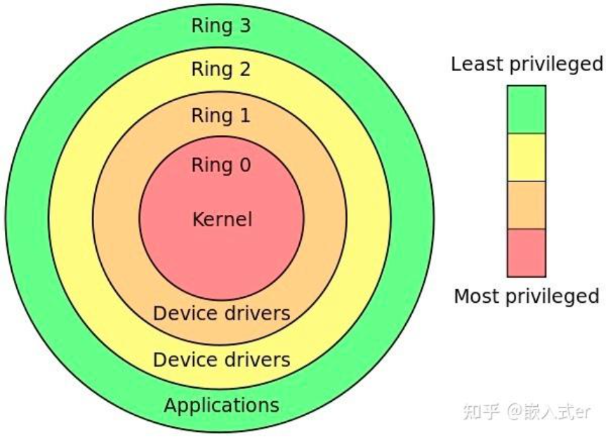

## CPU上下文
在每个任务运行前，CPU需要知道在哪里加载、启动任务，因此要提前帮助设置CPU寄存器和计数器
- CPU寄存器是内置于CPU中的小型但速度极快的闪存
- 计数器是用于存储CPU正在执行或下一条要执行指令的位置

因此CPU的上下文切换就指的是保存上一个任务的CPU上下文（CPU寄存器和计数器），然后将新任务的上下文加载到寄存器和计数器中，最后跳转

### CPU上下文切换类型
- 进程上下文切换
- 线程上下文切换
- 中断上下文切换

#### 进程上下文
Linux中按照特权等级将进程的运行空间划分为内核空间和用户空间  
上图中：
- 内核空间： ring0 拥有最高权限，可以访问所有资源
- 用户空间： ring3 只能访问受限资源，不能直接访问内存等硬件设备，必须通过系统调用被陷入到内核空间里，才能访问特权资源。

因此，一个进程既可以在用户空间也可以在内核空间，当进程运行在用户空间，被称为该进程的用户态，当陷入到内核空间，就称为该进程的内核态

那么如何从用户态到内核态呢，是通过系统调用来实现的，例如我们在驱动中经常使用的几个函数：
- open()
- read()
- write()
- close()

在使用上述函数的时候则发生CPU上下文切换。  
首先，先保存CPU寄存器中原来的用户态指令位置，接下来，为了执行内核态的代码，需要将CPU寄存器更新到内核态指令的位置，最后跳转到内核态运行内核任务。  
在系统调用结束后，CPU要恢复原来保存的用户状态，切换到用户空间继续运行  
**因此，每一次系统调用要进行两次CPU上下文切换**

注意的是，系统调用进程不会涉及到进程切换，与我们常说的进程上下文切换不同，进程上下文切换是从一个进程切换到另一个进程，而系统调用期间始终运行同一个进程。

所以系统调用过程通常叫做特权模式切换，而并不是上下文切换
 
##### 进程上下文切换与系统调用的区别
首先进程是由内核管理的，进程上下文切换只能发生在内核态，因此，进程上下文还包括虚拟内存、栈、和全局变量等用户空间资源，也包括内核栈、寄存器等内核空间状态。
所以进程上下文切换要比系统调用多一步：  
在保存当前进程的内核状态和CPU寄存器之前，要保存进程的虚拟内存、栈等，并加载下一个进程的内核状态。

进程何时会被调度/切换到CPU运行
- 当一个进程的CPU时间片用完，会被系统挂起，切换到其他等待CPU运行的进程
- 当系统资源不足，如内存不足，直到资源充足之前，进程无法运行，此时进程也会被挂起，系统会调度其他进程运行。
- 当一个进程通过sleep函数自己挂起，自然会被重新调度
- 当优先级较高的进程运行时，为了保证高优先级进程的运行，当前进程会被高优先级进程挂起
- 当发生硬件中断时，cpu上的进程会被中断挂起，转而执行内核上的中断服务函数

#### 线程上下文切换
**线程与进程的区别**：线程是任务调度的基本单位，而进程是资源获取的基本单位

也就是内核中所谓的任务调度，实际的调度对象就是线程，而进程只是为线程提供虚拟内存和全局变量等资源，也可以这样来理解： 
- 当一个进程只有一个线程时，可以认为一个进程等于一个线程
- 当一个进程又多个线程时，这些线程共享相同的资源，如虚拟内存、全局变量
- 此外，线程也可以有自己的私有数据，如栈和寄存器，在上下文切换的时候需要保存

因此，线程的上下文切换可以分为：
- 首先，前后两个线程属于不同的进程，那么因为资源不共享，所以切换过程和进程上下文切换相同
- 若前后两个线程属于相同进程，那么因为虚拟内存是共享的，因此切换时虚拟内存的资源保持不变，只需要切换线程的私有数据、栈、寄存器等私有数据

所以，同一个进程内的线程切换比多个进程消耗的资源要少，这也是多线程替代多进程的优势

#### 中断上下文
为了快速响应某些事件，硬件中断会中断正常的调度和执行过程，来调用中断服务函数

在中断其他进程的时候，需要保存当前进程的状态，以便中断后恢复
与进程上下文不同，中断上下文切换不涉及到进程的用户态，因此，即使中断进程中断了处于用户态的进程，也不需要保存和恢复进程的虚拟内存、全局变量等用户空间资源

另外，和进程上下文切换一样，中断上下文切换会消耗CPU，过多的切换会消耗大量的CPU资源，甚至严重降低系统的整体性能。

### 其他概念
#### 系统调用和CPU上下文切换的关系
1. 系统调用会导致CPU上下文切换，当用户发起系统调用时，需要从用户态切换到内核态，这涉及到CPU的上下文切换，因为内核态才有权限访问硬件资源，这个过程CPU需要保存用户空间的状态，并加载内核状态
2. 当系统调用完成后，如果用户程序需要继续执行，CPU现需要从内核态切换回用户态，这也是上下文的切换

