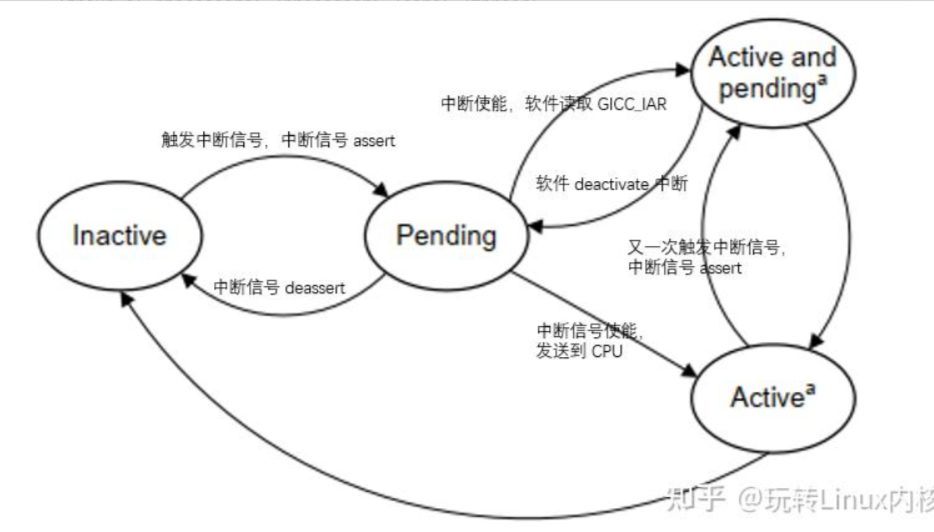
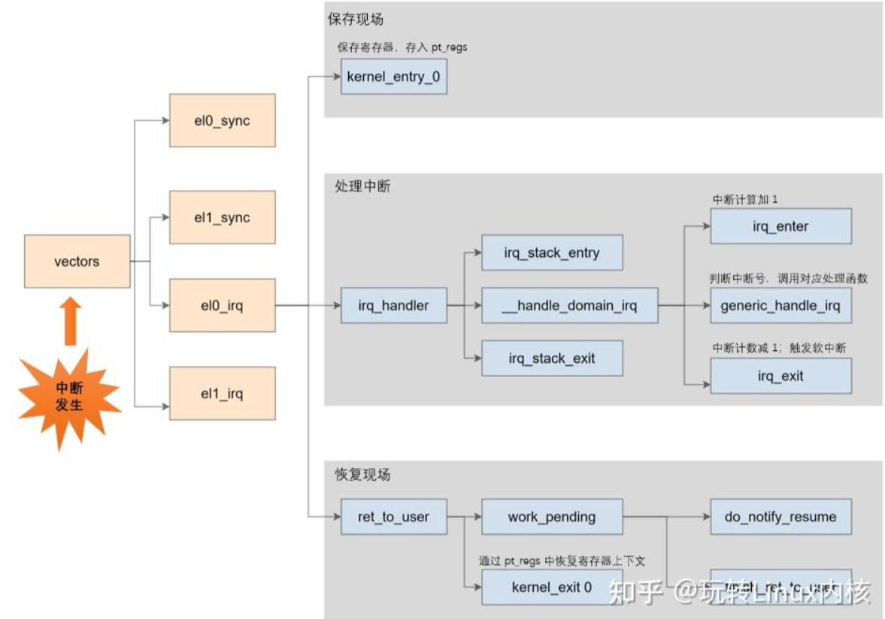

## 中断  

### 几个概念

#### 1.1 中断机制的目的和作用
- 外设异步通知CPU，比如定时器时间到、 或者收到一帧什么消息
- CPU之间，在多CPU系统，一个CPU要给另一个CPU发消息，可以发送IPI也就是处理器间的中断
- 处理CPU异常，异常中断
- 早期系统调用是靠中断指令来实现

#### 1.2 中断产生来源  
- 外设，外设产生的中断信号是异步的，一般也叫硬件中断
- CPU，是指一个CPU给另一个CPU发送IPI，这种中断叫处理期间中断
- CPU异常，一般CPU把自己的异常按照能不能修复，分为三种异常，1.塌陷(trap)，不需要修复，中断处理完后执行下一条指令，2.故障，需要修复也可能修复，中断处理完后重新执行之前的指令，3。中止，需要修复，但无法修复，中断处理完后内核会崩溃，比如缺页异常
- 中断指令，直接用CPU来产生中断信号。

#### 1.3 中断的处理
##### a) 执行场景
在中断产生之间，是没有这个概念的，有了中断后，将CPU分为了两个执行场景，为**进程执行场景** 和 **中断执行场景**，进程的执行是进程执行场景，同步中断的处理也是进程执行场景，异步中断的处理是中断处理场景。理解为因为同步中断处理是当前指令触发的，可以看作是进程的一部分，而异步中断的处理和当前指令无关。
- 进程执行场景可以调度，可以休眠，而中断执行场景无法调度也无法休眠
- 在进程执行场景中可以接受中断信号，但在中断执行场景是屏蔽了中断信号的，所以如果中断执行场景的时间太长，会影响对新中断的信号的响应性，所以应尽可能的缩短中断执行场景，那么对异步的中断处理有几种方法：
###### 1. 立即完全处理
对简单的异步中断完全处理
###### 2. 立即预处理+稍后完全处理
对于处理起来比较费时间的采取立即预处理加稍后完全处理，其实后者就是线程中断化，在linux中，中断预处理部分叫做上半部，中断后处理叫做下半部。

#### 1.4 中断向量号
不同的中断信号需要有不同的处理方式，所以需要靠中断向量号来区分，每一个中断信号都有一个中断向量号，中断向量号是一个整数，CPU收到中断信号后会根据信号的中断向量去查询中断向量表，根据向量表里去调用相应的中断处理函数。

特别的，对于CPU异常中断，其向量号是由架构规定的，而对于外设来说，是由设备驱动动态申请的。

### arm下中断
#### 2.1 中断控制器
ARM下提供了一个通用的中断控制器为GIC,主要是接受中断信号，处理后分发给CPU处理。以GIC v3版本为例，
#### 2.1.1 GIC中断类型
- SGI：软件触发的中断，软件可以通过写GICD_SGIR寄存器，来触发中断，一般用于核之间通信，内核中的IPI就是基于SGI。
- PPI：私有外设中断，这是每个核心私有的中断，PPI会送到指定的CPU上
- SPI：公用的外部设备中断，也叫共享中断

#### 2.1.2 GIC中断组成
- Distributor:spi的中断管理，将中断发送给Redistributor
1. 打开或关闭每个中断，Distributor对中断的控制分成了两级，一个是全局中断的控制(GIC_DIST_CTRL),一旦关闭全局中断，那么任何中断源的中断事件都并不会被传递给CPU，另一个是针对各个中断源的控制，(GIC_DIST_ENABLE_CLEAR),关闭某某一个只会导致某中断事件不会分发到CPU。 

2. 控制将当前优先级最高的中断事件分发到一个或者一组CPU，当一个中断事件分发到多个CPU的时候，GIC内部逻辑应该保证只发给一个CPU
3. 优先级控制
4. interrupt属性设定，设置每个外设的触发方式
5. interrupt group设定，设置每个中断组，其中group0用于安全中断，支持快速中断请求FIQ和一般中断请求IRQ,group1用于非安全中断，只支持IRQ

- Redistributor:
1. 启用和禁用SGI和PPI
2. 设置SGI和PPI的优先级
3. 将每个PPI设置为电平触发或边缘触发
4. 将每个SGI和PPI分配给中断组
5. 控制SGI和PPI状态
6. 内存中数据结构和基地址控制，支持LPI的相关中断属性和挂起状态
7. 电源管理支持

- CPU interface 传输中断给核
1. 打开或关闭CPU interface向连接的CPU assert事件，对于ARM,CPU interface和cpu之间的中断信号线是nIRQCPU和nFIQCPU,如果关了中断，即便Distributor分发了一个中断事件到了CPU interface，也不会assert指定的核

2. 中断的确认。核会向CPU interface应答中断，中断一旦被应答，Distribetor就会把该中断的状态从pending修改成active，或者pending and active，应答中断后，cpu interface就会deassert nIRQCPU和nFIQCPU信号线

3. 中断处理完毕的通知，当interrupt handler处理完一个函数后，会向CPU INTERFACE的寄存器通知GIC，CPU已经处理完了该中断，这个动作一方面是通知Distributor将中断状态改为deactive，另外一方面，CPU interface 会 priority drop，从而允许其他的 pending 的中断向 CPU 提交

4. 为 CPU 设置中断优先级掩码。通过 priority mask，可以 mask 掉一些优先级比较低的中断，这些中断不会通知到 CPU

5. 设置 CPU 的中断抢占（preemption）策略。

6. 在多个中断事件同时到来的时候，选择一个优先级最高的通知 CPU

#### 2.1.3 中断路由
GIC v3使用一个hierarchy来标识一个具体的core

#### 2.1.4 中断状态机


- Inactive:无中断状态，即没有pending也没有actice
- pending:由硬件或软件触发了中断，该中断事件已经通过硬件信号通知到了GIC，等待GIC分配到CPU处理
- active:CPU已经应答了中断请求，在处理中
- active and pending：当一个中断源处于active状态，同一中断源又触发了中断，进入pending状态

#### 2.1.5 中断处理流程
1. 外设发起中断，发送给Distributor
2. Distributor将该中断发给相应的Redistributor
3. Redistributor将该中断信息发送给CPU interface
4. CPU interface产生相应的中断信号给处理器
5. 处理器接受中断信号，处理中断处理函数

### GIC控制器中断流程
#### 3.1 中断注册
设备驱动中，获取到了IRQ的中断号后，通常使用request_irq/request_threaded_irq 来注册中断，其中前者用于注册普通的中断，后者用于注册线程化处理中断，而线程化中断主要是把中断上下文的任务搬到线程中，减少系统关中断事件。增强系统实时性。

#### 3.2 中断的处理
当完成中断注册后，剩下就是等待中断信号的来临。
在ARM架构中，EL0是ARMv8-A架构中定义的四个异常等级（Exception Levels）之一，被称为无特权执行级别。在这个级别上运行的是普通的用户应用程序
。EL0是最低的异常级别，通常用于执行用户态的代码，这些代码没有特权去访问或修改关键的系统资源或配置
。在ARMv8架构中，随着异常等级编号的增加，软件的执行权限也相应增加，EL0作为最低等级，拥有的权限也最少
。在ARM架构中，EL0和EL1是必须实现的，而EL2和EL3是可选的。

此时假设在当前EL0运行一个APP，触发了一个EL0的IRQ中断，则处理器会先跳转到arm对应的异常向量表，以arm-64为例，
```
/*
 * Exception vectors.
 */
        .pushsection ".entry.text", "ax"

        .align  11
SYM_CODE_START(vectors)
        ......
        
        kernel_ventry   1, sync                         // el1 下的同步异常，例如指令执行异常、缺页中断等
        kernel_ventry   1, irq                          // el1 下的异步异常，硬件中断。1代表异常等级
        kernel_ventry   1, fiq_invalid                  // FIQ EL1h
        kernel_ventry   1, error                        // Error EL1h

        kernel_ventry   0, sync                         // el0 下的同步异常，例如指令执行异常、缺页中断（跳转地址或者取地址）、系统调用等
        kernel_ventry   0, irq                          // el0 下的异步异常，硬件中断。0代表异常等级
        kernel_ventry   0, fiq_invalid                  // FIQ 64-bit EL0
        kernel_ventry   0, error                        // Error 64-bit EL0

        ......
#endif
SYM_CODE_END(vectors)
```

在上面的异常向量表中，设置了 各种异常的入口，kernel_ventry展开后，可以看到有效的异常入口又两个同步异常el0_sync,和el1_sync和两个异步异常el0_irq和el1_irq。

可以看到中断处理分为三部分:保护现场，中断处理，恢复现场。以el0_irq为例：

#### 3.3 保护现场
kernel_entry 0，其中 kernel_entry 是一个宏，此宏会将 CPU 寄存器按照 pt_regs 结构体的定义将第一现场保存到栈上。

```
.macro  kernel_entry, el, regsize = 64
.if     \regsize == 32
mov     w0, w0                          // zero upper 32 bits of x0
.endif
stp     x0, x1, [sp, #16 * 0]
stp     x2, x3, [sp, #16 * 1]
stp     x4, x5, [sp, #16 * 2]
stp     x6, x7, [sp, #16 * 3]
stp     x8, x9, [sp, #16 * 4]
stp     x10, x11, [sp, #16 * 5]
stp     x12, x13, [sp, #16 * 6]
stp     x14, x15, [sp, #16 * 7]
stp     x16, x17, [sp, #16 * 8]
stp     x18, x19, [sp, #16 * 9]
stp     x20, x21, [sp, #16 * 10]
stp     x22, x23, [sp, #16 * 11]
stp     x24, x25, [sp, #16 * 12]
stp     x26, x27, [sp, #16 * 13]
stp     x28, x29, [sp, #16 * 14]

.if     \el == 0
clear_gp_regs
mrs     x21, sp_el0
ldr_this_cpu    tsk, __entry_task, x20
msr     sp_el0, tsk
```

其中enable_da_f是关闭中断，保护现场主要的工作就是：
1. 保存PSTATE到SPSR_ELx寄存器
2. 将PSTATE的DAIF全部平壁
3. 保存PC寄存器的值到ELR_ELx寄存器

#### 3.4 中断处理
保护过现场后，会跳入irq_handler
```
/*
 * Interrupt handling.
 */
        .macro  irq_handler
        ldr_l   x1, handle_arch_irq
        mov     x0, sp
        irq_stack_entry      //进入中断栈
        blr     x1           //执行 handle_arch_irq
        irq_stack_exit       //退出中断栈
        .endm
```
这里主要做了三个动作：
1. 进入中断栈
2. 执行中断控制的handle_arch-irq
3. 退出中断栈

中断栈用来保存中断上下文，中断发生和退出的时候调用irq_stack_entry和irq_stack_exit来进入和退出中断栈，中断栈是内核启动的时候创建的，内核在启动的时候会给每个CPU创建一个per cpu的中断栈，也就是执行顺序：start_kernel->init_IRQ->init_irq_stacks.

那么handle_arch_irq又指向哪里？
在内核启动过程中初始化gic控制，会设置具体的handler，gic_init_bases->set_handle_irq将handle_arch_irq指向了gic_handle_irq函数，所以最终会进入gic_handle_irq，在这个函数里：
1. 读取GICC_IAR寄存器，获取hwirq
2. 外设触发的中断，硬件中断号 0-15 表示 SGI 类型的中断，15-1020 表示外设中断（SPI或PPI类型），8192-MAX 表示 LPI 类型的中断
3. 中断控制器的中断处理主体
4. 软件触发的中断
5. 核间交互触发的中断

其中中断控制器处理主体：
```
int __handle_domain_irq(struct irq_domain *domain, unsigned int hwirq,
   bool lookup, struct pt_regs *regs)
{
 struct pt_regs *old_regs = set_irq_regs(regs);        
 unsigned int irq = hwirq;
 int ret = 0;

 irq_enter();                               ------(1)

#ifdef CONFIG_IRQ_DOMAIN
 if (lookup)
  irq = irq_find_mapping(domain, hwirq);    ------(2)
#endif

 /*
  * Some hardware gives randomly wrong interrupts.  Rather
  * than crashing, do something sensible.
  */
 if (unlikely(!irq || irq >= nr_irqs)) {
  ack_bad_irq(irq);
  ret = -EINVAL;
 } else {
  generic_handle_irq(irq);                  ------(3)
 }

 irq_exit();                                ------(4)
 set_irq_regs(old_regs);
 return ret;
}
```

1. irq_enter();  进入中断上下文
2. irq = irq_find_mapping(domain, hwirq);根据hwirq来查找linux中断号
3. generic_handle_irq(irq);  也就是
```
static inline void generic_handle_irq_desc(struct irq_desc *desc)
{
 desc->handle_irq(desc);            
}
```
通过中断号找到全局中断描述符数组irq_desc[NR_IRQS]，然后调用该中断的action函数
4. irq_exit();  退出中断上下文

#### 3.5 恢复现场
1. disable中断
2. 检查在退出前有没有需要处理的事情
3. 将一开始压栈的pt_regs弹出，恢复现场

## Linux中的中断API函数

### 一、中断号
在linux中，使用一个int变量表示中断号其中有：
- 私有外设中断(PPI):中断号为16-31
- 共享外设中断(SPI):中断号为32-1020，对于imx6ull，实际支持的SPI中断号有128个，也就是ID为32-159
- 软件中断(SGI):通常为0-15

### 二、request_irq函数
在liunx中，要使用某个中断是需要申请的，使用request_irq函数用于申请中断，但是这个函数可能会导致睡眠，因此不能在中断上下文或者其他禁止睡眠的位置使用request_irq函数，函数原型：
```
int request_irq(unsigned int irq,     
                irq_handler_t handler,
                unsigned long  flags,  
                const char *name,
                void    *dev) 
```

其中：
- irq:要申请的中断号
- handler:中断处理函数
- flags:中断标志，都定义在include/linux/interrupt.h里，一些常用的有：  

| FLAG | 描述 |
| :----- | :----- | 
| IRQF_SHARE | 多个设备共享一个中断号的时候，共享的所有中断都指定这个中断标志，并使用request_irq里的dev参数来区分
| IRQF_ONESHOT| 单次中断，只执行一次 |
| IRQF_TRIGGER_NON | 无触发 |
| IRQF_TRIGGER_RISING | 上升沿触发 |
| IRQF_TRIGGER_FALLING | 下降沿触发 |
| IRQF_TRIGGER_HIGH  | 高电平触发 |
| IRQF_TRIGGER_LOW  | 低电平触发 |

- name:中断名字，设置后可以在/proc/interrupts文件里看到
- dev:为设备结构体，会传递到irq_handler_t的第二个参数

### 三、free_irq函数
使用中断时候request，同理使用完后，就要free掉，函数原型：
```
void free_irq(unsigned int irq, void *dev)
```

其中：
- irq:要释放的中断
- dev：设备

### 四、中断处理函数
在使用request_irq的时候，有一个参数是中断处理函数，格式如下：
` irqreturn_t (*irq_handler_t)(int, void*) `
其中，第一个参数是中断号，第二个函数是通用指针，通常和request_irq函数中的dev参数保持一致，返回类型是irqreturn_t，这是一个枚举类型，如下：
```
enum irqreturn {
    IRQ_NONE = (0 << 0),
    IRQ_HANDLED = (1 << 0),
    IRQ_WAKE_THREAD = (1 << 1),
};
```

### 五、中断使能与禁止
#### 使能
` void enable_irq(unsigned int irq) `

#### 禁止
` void disable_irq(unsigned int ir) `  

其中，禁止函数要等到当前在执行的中断处理函数执行完才返回，因此要保证不会产生新的中断，并确保所有已经开始执行的中断处理函数全部退出，在这种情况下有另一种禁止函数：
` void disable_irq_nosync(unsigned int irq) `

若需要关闭或者使能全部的中断系统，则使用：  

` local_irq_enable() `  

` local_irq_disable() `

但此时有一种情况：如果A任务用local_irq_disable关闭了全局中断10s,当运行第二秒的时候，B任务也用了下local_irq_disable，关闭全局中断3s,3秒以后B任务又使用了local_irq_enable函数打开全局中断，此使刚过去5秒，但是中断被打开了，所以为了避免这种情况，B任务不能粗暴的直接local_irq_enable，而是应该将中断状态恢复到之前的状态，这时候就要用：

` local_irq_save(flags) `  

` local_irq_restore(flags) `

## 上半部与下半部
对于中断处理函数来说，我们尽可能要运行时间短，不在中断中处理过多的任务，然而可能在实际使用时，无法避免这些问题，因此引入了一个上半部和下半部的概念。
在上半部处理一些简单、时间短的任务，比如初始化啊之类的，把耗时间的任务放到下半部就处理。
操作系统在执行处理函数时，会执行完上半部后，就返回，然后系统在调度中在去执行下半部的部分。

### 上半部
写在中断处理函数里的任务就是上半部

### 下半部
实现下半部的方法有以下：
- softirq :软中断
- tasklet :是将下半部通过一个结构体去管理，然后将该结构体放入内核提供的一个链表中，系统去调度，tasklet中的方法不能休眠，运行在中断上下文
- workqueue : 是将下半部通过一个结构体去管理，然后将结构体放入到内核提供的一个队列中，系统去调度，同时workqueue其中的方法可以休眠，运行在线程上下文

#### 


