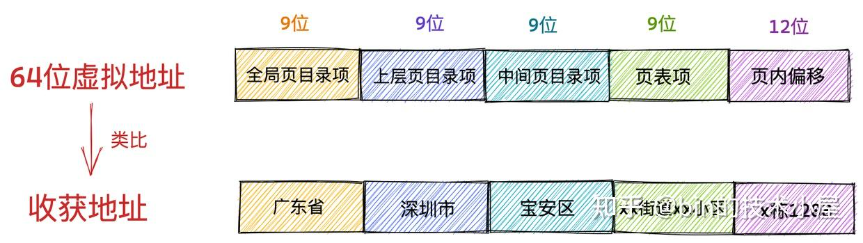
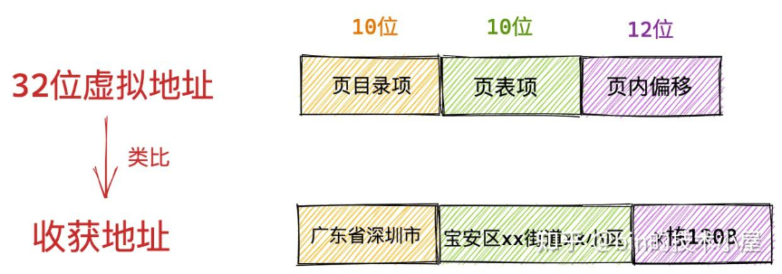

文章原文：https://zhuanlan.zhihu.com/p/577035415

## Linux 虚拟内存管理

当程序运行起来就成为了进程，而所有的数据结构引用在进程视角里都是虚拟内存地址，因为在进程中，无论在用户态还是内核态能够看到的都是虚拟内存空间，物理内存空间被操作系统所屏蔽。

进程通过虚拟内存地址访问数据结构的时候，下虚拟内存地址会在内存管理子系统中转换为物理内存地址，通过物理内存地址就可以访问到真正存储的数据结构的物理内存了，随后再对物理内存进行各种业务操作。从而完成业务逻辑

## 什么是虚拟内存地址
比如现实中人们给地址取了名字，如广东省深圳市宝安区xxxx等这些都是人为定义的名称而已，但地理位置是不会变的，几百年后，可能宝安不叫宝安，深圳不叫深圳，但位置始终在地球的这个位置，因此，虚拟地址是可以人为的改变，而物理地址是不会变的。

在计算机的世界里，内存地址是用来定义数据在内存的位置的，内存地址也分为了虚拟地址和物理地址，其中虚拟地址也是人为设计的一个概念，类比我们现实中的街道地址之类的，而物理地址就是在物理内存中真实储存的位置了。

虚拟地址长什么样子呢？
以现实生活中的例子，我们熟悉的收获地址是以xx省xx市xx区xx街道，这样按照地区层层递进的，在计算机里虚拟内存地址也是这样的递进关系。

以intel core i7处理器为例，64位虚拟地址的格式位为：
全局页目录项（9位）+ 上层页目录项（9位）+ 中间页目录项（9位）+ 页内偏移（12位）。共 48 位组成的虚拟内存地址。

所以虚拟内存地址中就类似这样的格式，而32位虚拟地址的格式为：页目录项（10位）+ 页表项（10位） + 页内偏移（12位）。共 32 位组成的虚拟内存地址。
  

## 为什么要使用虚拟地址来访问内存

- 如果直接物理内存地址会发生什么？
假设没有虚拟内存地址，我们直接来操作物理地址，那么程序员就需要知道每一个变量在内存中的具体位置，我们就需要对物理内存进行手动布局，还要为每个进程分配多少内存，避免资源冲突和紧缺。

如果我们在单进程系统中开发程序，系统只有一个进程，这个进程享有全部的物理资源，这种情况还较为好处理但现代操作系统中往往有多个进程，需要处理多进程之间的协同问题，那么问题就变的很复杂了

这里还有一个概念：**程序的局部性原理**  

*程序的局部性原理表现为时间局部性和空间局部性。时间局部性是指如果程序中某条指令一旦执行，则不久后该指令可能被再次执行，如果某个数据被访问，则不久后该数据可能被再次访问，空间局部性是指一旦程序访问了某个存储单元，则不久后，其附近的存储单元也将被访问*

因此，对于内存访问不会一下子就要全部访问，而是进程更倾向于访问最近访问过的数据以及热点数据附近的数据。

所以无论一个进程实际上可以占用的内存资源有多大，根据程序局部性原理，在某一段时间内，进程真正需要的物理内存其实很少，我们只需要为每个进程分配很少的物理内存就可以保证进程的正常执行。