文章原文：https://zhuanlan.zhihu.com/p/577035415

## Linux 虚拟内存管理

当程序运行起来就成为了进程，而所有的数据结构引用在进程视角里都是虚拟内存地址，因为在进程中，无论在用户态还是内核态能够看到的都是虚拟内存空间，物理内存空间被操作系统所屏蔽。

进程通过虚拟内存地址访问数据结构的时候，下虚拟内存地址会在内存管理子系统中转换为物理内存地址，通过物理内存地址就可以访问到真正存储的数据结构的物理内存了，随后再对物理内存进行各种业务操作。从而完成业务逻辑

## 什么是虚拟内存地址
比如现实中人们给地址取了名字，如广东省深圳市宝安区xxxx等这些都是人为定义的名称而已，但地理位置是不会变的，几百年后，可能宝安不叫宝安，深圳不叫深圳，但位置始终在地球的这个位置，因此，虚拟地址是可以人为的改变，而物理地址是不会变的。

在计算机的世界里，内存地址是用来定义数据在内存的位置的，内存地址也分为了虚拟地址和物理地址，其中虚拟地址也是人为设计的一个概念，类比我们现实中的街道地址之类的，而物理地址就是在物理内存中真实储存的位置了。

虚拟地址长什么样子呢？
以现实生活中的例子，我们熟悉的收获地址是以xx省xx市xx区xx街道，这样按照地区层层递进的，在计算机里虚拟内存地址也是这样的递进关系。

以intel core i7处理器为例，64位虚拟地址的格式位为：
全局页目录项（9位）+ 上层页目录项（9位）+ 中间页目录项（9位）+ 页内偏移（12位）。共 48 位组成的虚拟内存地址。


所以虚拟内存地址中就类似这样的格式，而32位虚拟地址的格式为：页目录项（10位）+ 页表项（10位） + 页内偏移（12位）。共 32 位组成的虚拟内存地址。
  

## 为什么要使用虚拟地址来访问内存

- 如果直接物理内存地址会发生什么？
假设没有虚拟内存地址，我们直接来操作物理地址，那么程序员就需要知道每一个变量在内存中的具体位置，我们就需要对物理内存进行手动布局，还要为每个进程分配多少内存，避免资源冲突和紧缺。

如果我们在单进程系统中开发程序，系统只有一个进程，这个进程享有全部的物理资源，这种情况还较为好处理但现代操作系统中往往有多个进程，需要处理多进程之间的协同问题，那么问题就变的很复杂了

这里还有一个概念：**程序的局部性原理**  

*程序的局部性原理表现为时间局部性和空间局部性。时间局部性是指如果程序中某条指令一旦执行，则不久后该指令可能被再次执行，如果某个数据被访问，则不久后该数据可能被再次访问，空间局部性是指一旦程序访问了某个存储单元，则不久后，其附近的存储单元也将被访问*

因此，对于内存访问不会一下子就要全部访问，而是进程更倾向于访问最近访问过的数据以及热点数据附近的数据。

所以无论一个进程实际上可以占用的内存资源有多大，根据程序局部性原理，在某一段时间内，进程真正需要的物理内存其实很少，我们只需要为每个进程分配很少的物理内存就可以保证进程的正常执行。


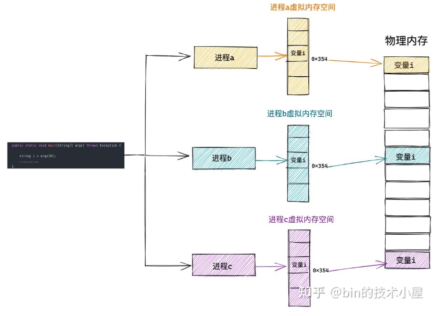

这样进程就以为自己独占了内存空间，这其实只是CPU和操作系统使用的一个障眼法，任何一个虚拟内存里所存储的数据，本质还是存储在真实的物理地址上，只是内核做了虚拟内存到物理内存的一层映射，将不同的虚拟地址和不同的物理地址映射了起来，当CPU访问虚拟地址时，再经过地址翻译将虚拟地址转换成不同的物理地址，这样当不同进程运行的时候，虽然操作的是同一个虚拟地址，但本质调用的是不同的物理地址。

## 进程虚拟内存空间

进程独占的虚拟空间到底是什么样子？

这里只讨论进程的用户空间中的内存空间分布

首先，一个进程运行起来是为了执行交给进程的任务，而执行的步骤是我们通过代码事先编写好，并编译成二进制文件存放在磁盘中，CPU执行二进制文件中的机器码来驱动进程运行。所以在进程的运行前，这些存放在二进制文件中的机器码需要被加载进内存中，而用于存放代码的虚拟内存叫做代码段。


在程序运行起来后，通常会定义大量的全局变量和静态变量，这些全局变量在被编译后也会存储在二进制文件中，而在程序运行之前，这些全局变量也需要被加载进内存中供程序访问，所以虚拟内存空间里也需要一部分来存储全局变量。

- 所以在代码中被我们指定了初始值的全局变量和静态变量在虚拟内存空间里的存储区被我们叫做数据段

- 那么没有指定初始值的全局变量和静态变量在虚拟内存空间中的存储区我们叫BSS段，这些没有初始化的全局变量被加载进内存后被初始化为0。


上述介绍的这些全局变量和静态变量都是在编译期间就确定的，但是程序运行期间往往需要动态申请内存，所以在虚拟内存空间中也需要一块区域来存放动态申请的内存，这块区域叫做堆，这里的堆指的是OS堆。


除此之外，程序在运行过程中还需要依赖动态链接库，这些动态链接库以.so文件的形式存放在磁盘，比如C代码里的glibc，里面堆系统调用进行了封装，glibc库里提供用与动态申请堆内存的malloc函数，就是对系统调用sbrk和mmap的封装，这些动态连接库，也有自己的代码段、数据段、BSS段、也要被一起加载进内存中。

还有用于内存文件映射的系统调用mmap，会将文件与内存进行映射，映射的这块内存（虚拟内存），也需要在虚拟地址空间中有一块区域存储。

这些动态链接库中的代码段、数据段、BSS段、以及通过mmap系统调用的共享内存区，在虚拟内存空间的存储区叫做文件映射与匿名映射区。  


最后我们运行程序的时候调用各种函数，在调用函数的过程中使用到的局部变量和参数也需要内存来保存，这个区域叫做栈。

 

所以这就是进程的虚拟内存空间所包含的主要区域：
- 用于存放程序二进制文件的代码段
- 用于存放程序中定义的全局变量和静态变量的数据段和BSS段
- 用于程序运行中动态申请内存的堆
- 用于存放动态链接库以及内存映射的文件映射和匿名映射区
- 用于存放函数调用的局部变量和函数参数的栈

## Linux 进程虚拟内存空间

### 32位机器上进程虚拟内存空间分布

在32位机器上，指针的寻址范围为$2^{32}$, 所能表达的虚拟内存空间为4GB,所以在32位机器上进程的虚拟内存地址是0x00000000-0xxFFFFFFFF

其中，用户态虚拟内存空间为3GB，内存地址范围为0x0000000-0xC0000000.

内核态虚拟内存空间为1GB，范围为0xC0000000-0xFFFFFFFF


1. 但用户态虚拟内存空间中的代码段并不是从0x000000开始的而是从0x08048000开始的，因为留了一段叫做保留区，因为在大多操作系统中，数值比较小的地址通常被人为不是一个合法的地址，这块小地址是不被允许访问的，比如在代码里通常会将一些无效指针设置为NULL，来指向这块不被访问的地址。

2. 保留区的上边就是代码段和数据段，他们都是从二进制文件中被加载进内存的，BSS段中的数据也会存在与二进制文件中，内核知道这些数据没有初始值，所以在二进制文件只记录BSS段的大小，被加载进内存时被0填充

3. 紧挨着就是堆空间，图中可以看到堆空间中地址的增长方向是从低地址到高地址。内核中使用着start_brk来标识堆的起始位置，brk标识堆当前的结束位置。当堆申请新的内存空间时，只需要将brk指针增加对应的大小，回收地址时减少对应的大小即可。比如当我们通过malloc向内核申请很小的一块内存时，就是通过改变brk位置实现的。

4. 堆的上边是一段待分配区域，用于扩展堆空间。

5. 接下来就是到了文件映射与匿名映射区。。进程运行时所依赖的动态链接库中的代码段，数据段，BSS段就加载在这里。还有我们调用mmap映射出来的一段虚拟内存空间也保存在这个区域。在文件映射与匿名映射区的地址增长方向是从高地址向低地址增长。

6. 接下来用户态虚拟内存空间的最后一块区域就是栈空间，在这里保存函数运行时所需要的局部变量以及函数参数等信息。栈空间中的地址增长方向是从高地址向低地址增长。

7. 在内核中使用start_stack标识栈的起始位置，RSP寄存器保存栈顶指针stack_pointer, RBP寄存器保存栈基地址。

8. 在栈空间的下面也有一块待分配的区域，用于扩展栈空间。而栈空间的上面就是内核空间了。进程无法访问。

### 64位机器上进程虚拟内存空间分布

在32位机器上，指针的寻址范围为$2^{32}$，所能表达的虚拟内存空间为4GB，而64位机器上，只使用了48位来描述虚拟内存空间，寻址范围为$2^{48}$,,所表达的下虚拟内存空间为256TB，其中低128TB表示用户态虚拟内存空间，范围为0x0000000000000000-0x00007FFFFFFFF000高128TB表示内核虚拟空间,地址范围为：0xFFFF800000000000-0xFFFFFFFFFFFFFFFF.

因此，在用户态和内核态的虚拟内存空间形成了一段0x00007FFFFFFFF000-0xFFFF800000000000的地址空洞，这个空洞叫做canonical address

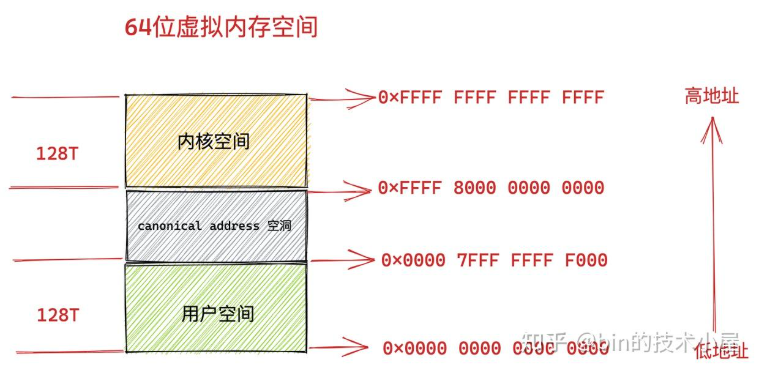

这是因为我们在64位机器上只使用了低48位来表示虚拟内存地址，那么多出的这16位就形成了地址空洞。

- 可以看到用户态虚拟空间地址的高16位全都是0000，所以如果一个虚拟内存地址的高16位都是0，可以直接判断这是一个用户空间的虚拟内存地址。
- 同样的，如果高16位都是1，那么可以直接判断是在内核的虚拟内存地址。

- 如果一个试图访问内核的虚拟地址高16位不全为，则可以快速判断这个访问是非法的。

这个高 16 位的空闲地址被称为 canonical 。如果虚拟内存地址中的高 16 位全部为 0 （表示用户空间虚拟内存地址）或者全部为 1 （表示内核空间虚拟内存地址），这种地址的形式我们叫做 canonical form，对应的地址我们称作 canonical address。
那么处于 canonical address 空洞 ：0x0000 7FFF FFFF F000 - 0xFFFF 8000 0000 0000 范围内的地址的高 16 位 不全为 0 也不全为 1 。如果某个虚拟地址落在这段 canonical address 空洞区域中，那就是既不在用户空间，也不在内核空间，肯定是非法访问了。未来我们也可以利用这块 canonical address 空洞，来扩展虚拟内存地址的范围，比如扩展到 56 位。

#### Linux系统下的真实虚拟内存空间布局为：

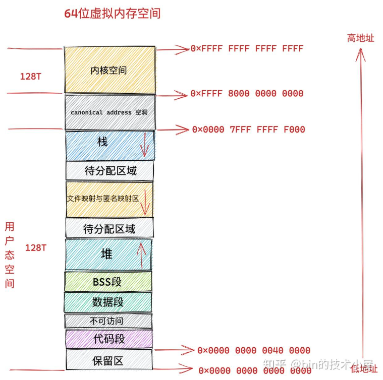

从图中可以看到，64位和32位的虚拟内存布局时差不多的，不同点在于： 
1. 存在了一个高16位的空闲地址
2. 在代码段和数据段之间还有一段不可读写的保护段，作用是防止程序在读写数据段的时候越界到代码段，因此为了防止越界访问导致崩溃。
3. 用户态虚拟内存空间与内核态虚拟内存空间分别占用128TB。


## 进程虚拟内存空间的管理

进程的虚拟内存空间管理，离不开进程的内核中的描述符task_struct结构：  
```
struct task_struct {
        // 进程id
     pid_t    pid;
        // 用于标识线程所属的进程 pid
     pid_t    tgid;
        // 进程打开的文件信息
        struct files_struct  *files;
        // 内存描述符表示进程虚拟地址空间
        struct mm_struct  *mm;

        .......... 省略 .......
}
```

在进程描述符task_struct结构中，有一个专门描述虚拟内存描述符mm_struct结构，这个结构体中包含了前面介绍的进程虚拟内存空间的全部信息。

每一个进程都有唯一的一个mm_struct结构体，也就是每个进程的虚拟地址空间都是独立的，互不干扰。

当调用fork()函数创建进程的时候，表示进程地址空间的mm_struct结构会随着进程描述符task_struct创建的时候而创建。

```
long _do_fork(unsigned long clone_flags,
       unsigned long stack_start,
       unsigned long stack_size,
       int __user *parent_tidptr,
       int __user *child_tidptr,
       unsigned long tls)
{
        ......... 省略 ..........
 struct pid *pid;
 struct task_struct *p;

        ......... 省略 ..........
    // 为进程创建 task_struct 结构，用父进程的资源填充 task_struct 信息
 p = copy_process(clone_flags, stack_start, stack_size,
    child_tidptr, NULL, trace, tls, NUMA_NO_NODE);

         ......... 省略 ..........
}
```

在task_struct后，会在copy_process函数中创建task_struct结构，并拷贝父进程的相关资源到新进程的task_struct结构体，其中就包括拷贝父进程的虚拟内存空间mm_struct结构，这里可以看到子进程在新创建后他的虚拟内存空间和父进程的虚拟内存空间一模一样，是直接拷贝的。

```
static __latent_entropy struct task_struct *copy_process(
     unsigned long clone_flags,
     unsigned long stack_start,
     unsigned long stack_size,
     int __user *child_tidptr,
     struct pid *pid,
     int trace,
     unsigned long tls,
     int node)
{

    struct task_struct *p;
    // 创建 task_struct 结构
    p = dup_task_struct(current, node);

        ....... 初始化子进程 ...........

        ....... 开始继承拷贝父进程资源  .......      
    // 继承父进程打开的文件描述符
 retval = copy_files(clone_flags, p);
    // 继承父进程所属的文件系统
 retval = copy_fs(clone_flags, p);
    // 继承父进程注册的信号以及信号处理函数
 retval = copy_sighand(clone_flags, p);
 retval = copy_signal(clone_flags, p);
    // 继承父进程的虚拟内存空间
 retval = copy_mm(clone_flags, p);
    // 继承父进程的 namespaces
 retval = copy_namespaces(clone_flags, p);
    // 继承父进程的 IO 信息
 retval = copy_io(clone_flags, p);

      ...........省略.........
    // 分配 CPU
    retval = sched_fork(clone_flags, p);
    // 分配 pid
    pid = alloc_pid(p->nsproxy->pid_ns_for_children);

.     ..........省略.........
}
```

其中就有copy_mm函数，在这里完成进程的虚拟内存空间mm_struct结构的创建和初始化，函数原型是：

```

static int copy_mm(unsigned long clone_flags, struct task_struct *tsk)
{
    // 子进程虚拟内存空间，父进程虚拟内存空间
 struct mm_struct *mm, *oldmm;
 int retval;

        ...... 省略 ......

 tsk->mm = NULL;
 tsk->active_mm = NULL;
    // 获取父进程虚拟内存空间
 oldmm = current->mm;
 if (!oldmm)
  return 0;

        ...... 省略 ......
    // 通过 vfork 或者 clone 系统调用创建出的子进程（线程）和父进程共享虚拟内存空间
 if (clone_flags & CLONE_VM) {
        // 增加父进程虚拟地址空间的引用计数
  mmget(oldmm);
        // 直接将父进程的虚拟内存空间赋值给子进程（线程）
        // 线程共享其所属进程的虚拟内存空间
  mm = oldmm;
  goto good_mm;
 }

 retval = -ENOMEM;
    // 如果是 fork 系统调用创建出的子进程，则将父进程的虚拟内存空间以及相关页表拷贝到子进程中的 mm_struct 结构中。
 mm = dup_mm(tsk);
 if (!mm)
  goto fail_nomem;

good_mm:
    // 将拷贝出来的父进程虚拟内存空间 mm_struct 赋值给子进程
 tsk->mm = mm;
 tsk->active_mm = mm;
 return 0;

        ...... 省略 ......
```

### 内核如何划分用户态和内核态的虚拟内存空间

上一节可以看到进程的虚拟内存空间是分为了两部分的，一个是用户态的虚拟内存空间，一个是内核态虚拟内存空间，那么是如何划分的呢。

在32位系统中，用户态虚拟内存空间是3GB，内核时1GB。

32位系统中用户态和内核态虚拟内存空间分界线是0xC0000000,那么自然进程的mm_struct结构中task_size就是0xC0000000了。

在/arch/x86/include/asm/page_32_types.h中，关于task_size是这样定义的：

```
/*
 * User space process size: 3GB (default).
 */
#define TASK_SIZE  __PAGE_OFFSET
```
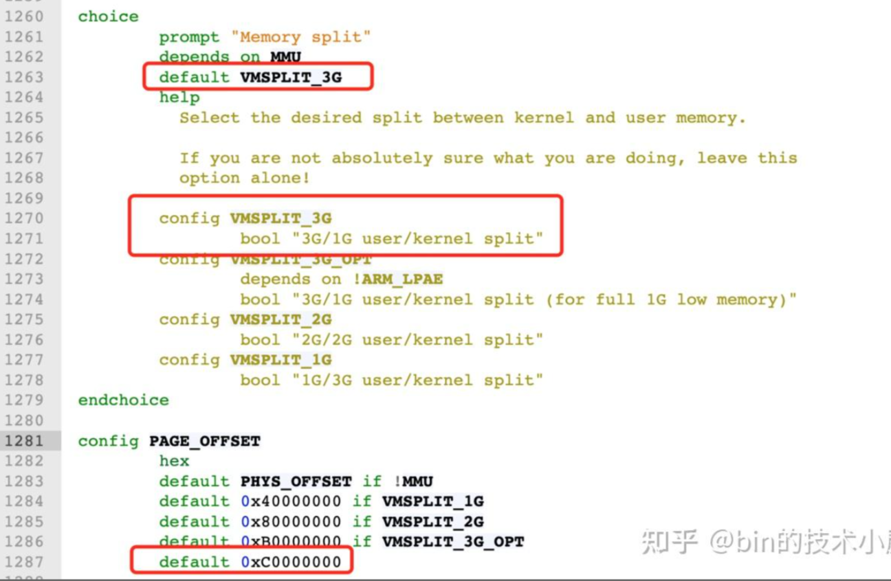
__PAGE_OFFSET在32位系统下就是0xC0000000.

而在64位系统中，只使用了48位来表示虚拟内存地址，其中用户态是在低128TB,内核态是高128TB.64 位系统中用户地址空间和内核地址空间的分界线在 0x0000 7FFF FFFF F000 地址处，那么自然进程的 mm_struct 结构中的 task_size 为 0x0000 7FFF FFFF F000 

那么在/arch/x86/include/asm/page_64_types.h中，关于TASK_SIZE则是：  
```
#define TASK_SIZE  (test_thread_flag(TIF_ADDR32) ? \
     IA32_PAGE_OFFSET : TASK_SIZE_MAX)

#define TASK_SIZE_MAX  task_size_max()

#define task_size_max()  ((_AC(1,UL) << __VIRTUAL_MASK_SHIFT) - PAGE_SIZE)

#define __VIRTUAL_MASK_SHIFT 47

```

在 task_size_max() 的计算逻辑中 1 左移 47 位得到的地址是 0x0000800000000000，然后减去一个 PAGE_SIZE （默认为 4K），就是 0x00007FFFFFFFF000，共 128T。所以在 64 位系统中的 TASK_SIZE 为 0x00007FFFFFFFF000

*这里我们可以看出，64 位虚拟内存空间的布局是和物理内存页 page 的大小有关的，物理内存页 page 默认大小 PAGE_SIZE 为 4K*。

### 内核如何布局进程虚拟内存空间
来详细看一下mm_struct部分，
```
struct mm_struct {
    unsigned long task_size;    /* size of task vm space */
    unsigned long start_code, end_code, start_data, end_data;
    unsigned long start_brk, brk, start_stack;
    unsigned long arg_start, arg_end, env_start, env_end;
    unsigned long mmap_base;  /* base of mmap area */
    unsigned long total_vm;    /* Total pages mapped */
    unsigned long locked_vm;  /* Pages that have PG_mlocked set */
    unsigned long pinned_vm;  /* Refcount permanently increased */
    unsigned long data_vm;    /* VM_WRITE & ~VM_SHARED & ~VM_STACK */
    unsigned long exec_vm;    /* VM_EXEC & ~VM_WRITE & ~VM_STACK */
    unsigned long stack_vm;    /* VM_STACK */

       ...... 省略 ........
}
```

内核中使用了mm_strut结构体来定义了虚拟内存空间里的不同区域，- start_code和end_code定义了代码段的起始和结束位置，代码编译后的二进制文件中的机器码就被加载进这里
- start_data和end_data定义数据段的起始和结束位置，二进制文件中的全局变量、静态变量被加载进这里
- mm_struct不直接描述BSS段，因为BSS段在代码加载时会被操作系统初始化为0，并且在二进制文件中不包含实际的数据内容，而只是记录该段大小，因此不占用文件的存储空间。
- 接下来就是堆空间，堆在内存地址中的增长方向是从低地址到高地址的增长，使用了start_brk和brk，分别定义堆的起始和中止位置，‘
- 接下来是内存映射区，mmap_base描述的是内存映射区的起始地址，进程运行时所依赖的动态链接库中的代码段、数据段、BSS段以及mmap映射出来的虚拟空间被一起保存在这个区域。
- start_stack时栈的起始位置，在RBP寄存器中存储，栈的结束位置就是栈顶指针stack_pointer在RSP寄存器存储。栈中内存地址方向是从高地址向低地址增长。
- arg_start和arg_end是参数列表的位置
- env_start和env_end是环境变量的位置，都处于栈的最高地址

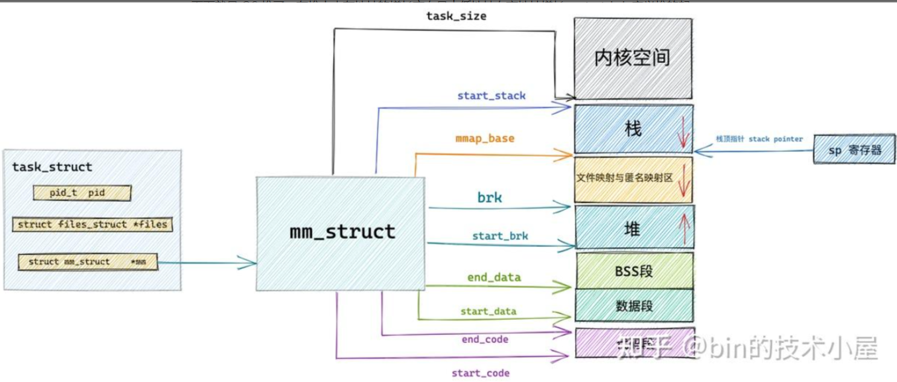

在mm_struct结构体中除了用于划分虚拟内存区域的变量，还定义了一些虚拟内存与物理内存映射内容相关的统计变量，操作系统会把物理内容划分成一页一页的区域来进行管理。所以从物理内存到虚拟内存之间的映射也是按照页为单位进行的。

mm_struct 结构体中的 total_vm 表示在进程虚拟内存空间中总共与物理内存映射的页的总数。

当内存吃紧的时候，有些页可以换出到硬盘上，而有些页因为比较重要，不能换出。locked_vm 就是被锁定不能换出的内存页总数，pinned_vm 表示既不能换出，也不能移动的内存页总数。

data_vm 表示数据段中映射的内存页数目，exec_vm 是代码段中存放可执行文件的内存页数目，stack_vm 是栈中所映射的内存页数目，这些变量均是表示进程虚拟内存空间中的虚拟内存使用情况。

### 内核如果管理虚拟内存区域

内核划分出来的比如代码段、数据段、BSS段、堆、映射段、栈，在内核中是如何表示的呢

是另一个结构体vm_area_struct，这个结构体就是描述了虚拟内存区域VMA的

```
struct vm_area_struct {

 unsigned long vm_start;  /* Our start address within vm_mm. */
 unsigned long vm_end;  /* The first byte after our end address
        within vm_mm. */
 /*
  * Access permissions of this VMA.
  */
 pgprot_t vm_page_prot;
 unsigned long vm_flags; 

 struct anon_vma *anon_vma; /* Serialized by page_table_lock */
    struct file * vm_file;  /* File we map to (can be NULL). */
 unsigned long vm_pgoff;  /* Offset (within vm_file) in PAGE_SIZE
        units */ 
 void * vm_private_data;  /* was vm_pte (shared mem) */
 /* Function pointers to deal with this struct. */
 const struct vm_operations_struct *vm_ops;
}
```

每个vm_area_struct结构体对应与虚拟内存空间的唯一虚拟内存区域vma,而vm_start指向的是这块虚拟内存区域的起始地址，vm_start本身也包含在这块虚拟内存区域里，vm_end指向了这块虚拟内存区域的结束地址，而vm_end包含在这块区域里外，所以vm_area_struct结构体描述的是[vm_start, vm_end)这样的一段左闭右开的内存区域

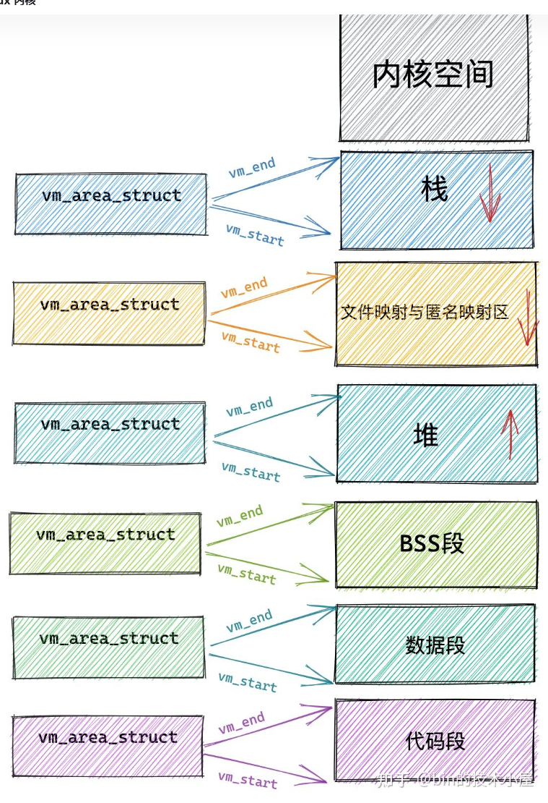

### 定义虚拟内存区域的访问权限和行为规范

vm_page_prot 和 vm_flags 都是用来标记 vm_area_struct 结构表示的这块虚拟内存区域的访问权限和行为规范

内核会将整块物理内存划分为一页一页大小的区域，以页为单位来管理这些物理内存，每页大小默认 4K 。而虚拟内存最终也是要和物理内存一一映射起来的，所以在虚拟内存空间中也有虚拟页的概念与之对应，虚拟内存中的虚拟页映射到物理内存中的物理页。无论是在虚拟内存空间中还是在物理内存中，内核管理内存的最小单位都是页。

vm_page_prot 偏向于定义底层内存管理架构中页这一级别的访问控制权限，它可以直接应用在底层页表中，它是一个具体的概念

虚拟内存区域 VMA 由许多的虚拟页 (page) 组成，每个虚拟页需要经过页表的转换才能找到对应的物理页面。页表中关于内存页的访问权限就是由 vm_page_prot 决定的

vm_flags 则偏向于定于整个虚拟内存区域的访问权限以及行为规范。描述的是虚拟内存区域中的整体信息，而不是虚拟内存区域中具体的某个独立页面。它是一个抽象的概念。可以通过 vma->vm_page_prot = vm_get_page_prot(vma->vm_flags) 实现到具体页面访问权限 vm_page_prot 的转换。

常用的vm_flags:

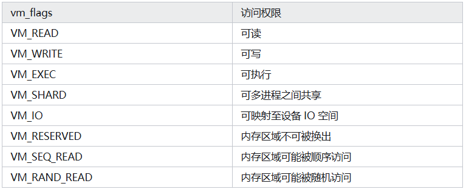

### 关联内存映射中的映射关系
接下来的三个属性 anon_vma，vm_file，vm_pgoff 分别和虚拟内存映射相关，虚拟内存区域可以映射到物理内存上，也可以映射到文件中，映射到物理内存上我们称之为匿名映射，映射到文件中我们称之为文件映射。

### 针对虚拟内存区域的操作
struct vm_area_struct结构体中还有一个vm_ops用来指向针对虚拟内存区域VMA相关操作的函数指针。
```
struct vm_operations_struct {
 void (*open)(struct vm_area_struct * area);
 void (*close)(struct vm_area_struct * area);
    vm_fault_t (*fault)(struct vm_fault *vmf);
    vm_fault_t (*page_mkwrite)(struct vm_fault *vmf);

    ..... 省略 .......
}
```

- 当指定的虚拟内存区域被加载到进程虚拟内存空间中，open函数被调用
- 当虚拟内存区域VMA从进程虚拟内存空间中删除时，close函数被调用
- 当进程访问虚拟内存时，访问的页面不存在在物理内存时，可能时未分配物理内存，也可能是被置换到了磁盘中，就会产生缺页异常，fault就会被调用
- 当一个只读页面变为可写时，page_mkwrite函数被调用

struct vm_operations_struct 结构中定义的都是对虚拟内存区域 VMA 的相关操作函数指针

## 内核虚拟内存空间

### ！内核态虚拟内存空间是所有进程共享的，也就是不同的进程进入内核态后看到的虚拟内存空间是一样的。

### 内核虚拟内存空间布局
#### 32位机器
##### 直接映射区

在总共1GB的内核虚拟内存空间中，位于最前面有一块大小为896M的区域，称为*直接映射区/线性映射区*

是因为这块连续的虚拟内存地址会直接映射到0-896M这块连续的物理内存上

*在这块区域上，虚拟内存地址直接减去0xC0000000就得到了物理内存地址*

现在假设机器上的物理内存为4GB
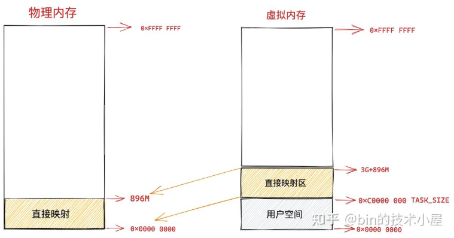

在这块896M的物理内存中，前1M已经在系统启动的时候被系统占用，1M之后的物理内存放的是内核的代码段、数据段、BSS段，在系统启动的时候被加载

可以通过cat /proc/iomem查看具体物理内存的布局情况

当我们使用fork函数调用创建进程的时候，内核会创建一系列进程相关的描述符，如task_struct，mm_struct，以及虚拟内存区域描述vm_area_struct等

这些进程相关的数据结构也会存放在物理内存前 896M 的这段区域中，当然也会被直接映射至内核态虚拟内存空间中的 3G -- 3G + 896m 这段直接映射区域中

当进程被创建完毕之后，在内核运行的过程中，会涉及内核栈的分配，*内核*会为每个进程分配一个*固定大小*的*内核栈*（一般是两个页大小，依赖具体的体系结构），每个进程的整个调用链必须放在自己的内核栈中，内核栈也是分配在直接映射区。

与进程用户空间中的栈不同的是，内核栈容量小而且是固定的，用户空间中的栈容量大而且可以动态扩展。内核栈的溢出危害非常巨大，它会直接悄无声息的覆盖相邻内存区域中的数据，破坏数据。

在 X86 体系结构下，ISA 总线的 DMA （直接内存存取）控制器，只能对内存的前16M 进行寻址，这就导致了 ISA 设备不能在整个 32 位地址空间中执行 DMA，只能使用物理内存的前 16M 进行 DMA 操作。

因此直接映射区的前 16M 专门让内核用来为 DMA 分配内存，这块 16M 大小的内存区域我们称之为 ZONE_DMA。

而直接映射区中剩下的部分也就是从 16M 到 896M（不包含 896M）这段区域，我们称之为 ZONE_NORMAL。从字面意义上我们可以了解到，这块区域包含的就是正常的页框

ZONE_NORMAL 由于也是属于直接映射区的一部分，对应的物理内存 16M 到 896M 这段区域也是被直接映射至内核态虚拟内存空间中的 3G + 16M 到 3G + 896M 这段虚拟内存上。

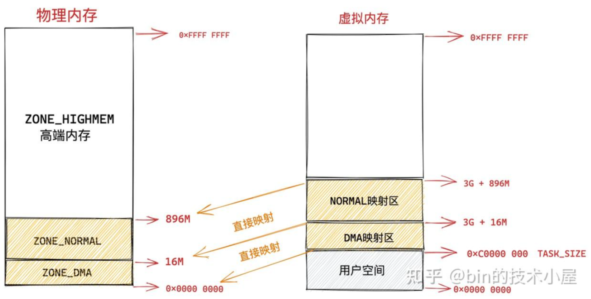

##### ZONE HIGHMEM 高端内存

在直接映射区上方区域被内核划分为ZONE_GIHGMEM区域，称为高端内存

假设物理内存为4G，高端内存区域是4G-896M也就是3200M，那么这块3200M大小的区域如何映射呢

由于内核虚拟空间中前896M被直接映射区占用，而32位系统下内核虚拟内存空间也就1GB，因此，内核剩下的就是1G-896M =128M，显然物理内存中的3200M大小的ZONE_HIGHMEM无法直接映射128M的虚拟内存空间里。

所以只能通过动态映射，也就是先映射正在使用的一部分，使用完毕后解除映射，再映射别的部分
内核虚拟内存空间中的 3G + 896M 这块地址在内核中定义为 high_memory，high_memory 往上有一段 8M 大小的内存空洞。空洞范围为：high_memory 到 VMALLOC_START 

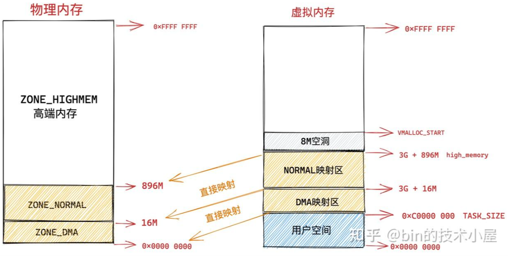

##### vmalloc动态映射区

接下来的VMALLOC_START到VMALLOC_END之间这块区域称为动态映射区，采用动态映射的方式映射到物理内存的高端内存中

和用户态进程使用malloc申请内存一样，在这块动态映射区内核使用vmalloc进行内存分配，但实际中，vmalloc分配的内存在虚拟上是连续的，但在物理内存是不连续的，因此需要通过页表来建立物理内存和虚拟内存之间的映射关系


##### 永久映射区

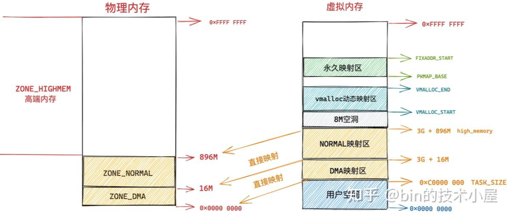
而在 PKMAP_BASE 到 FIXADDR_START 之间的这段空间称为永久映射区。在内核的这段虚拟地址空间中允许建立与物理高端内存的长期映射关系。比如内核通过 alloc_pages() 函数在物理内存的高端内存中申请获取到的物理内存页，这些物理内存页可以通过调用 kmap 映射到永久映射区中。

##### 固定映射区


内核虚拟内存空间中的下一个区域为固定映射区，区域范围为：FIXADDR_START 到 FIXADDR_TOP。

在内核虚拟内存空间的直接映射区中，直接映射区中的虚拟内存地址与物理内存前 896M 的空间的映射关系都是预设好的，一比一映射。

在固定映射区中的虚拟内存地址可以自由映射到物理内存的高端地址上，但是与动态映射区以及永久映射区不同的是，在固定映射区中虚拟地址是固定的，而被映射的物理地址是可以改变的。也就是说，有些虚拟地址在编译的时候就固定下来了，是在内核启动过程中被确定的，而这些虚拟地址对应的物理地址不是固定的。采用固定虚拟地址的好处是它相当于一个指针常量（常量的值在编译时确定），指向物理地址，如果虚拟地址不固定，则相当于一个指针变量。

那为什么会有固定映射这个概念呢 ? 比如：在内核的启动过程中，有些模块需要使用虚拟内存并映射到指定的物理地址上，而且这些模块也没有办法等待完整的内存管理模块初始化之后再进行地址映射。因此，内核固定分配了一些虚拟地址，这些地址有固定的用途，使用该地址的模块在初始化的时候，将这些固定分配的虚拟地址映射到指定的物理地址上去。

##### 临时映射区
在内核虚拟内存空间中的最后一块区域为临时映射区


## 整体虚拟内存空间
因此，在32位linux下，整个虚拟内存空间的布局就是:  
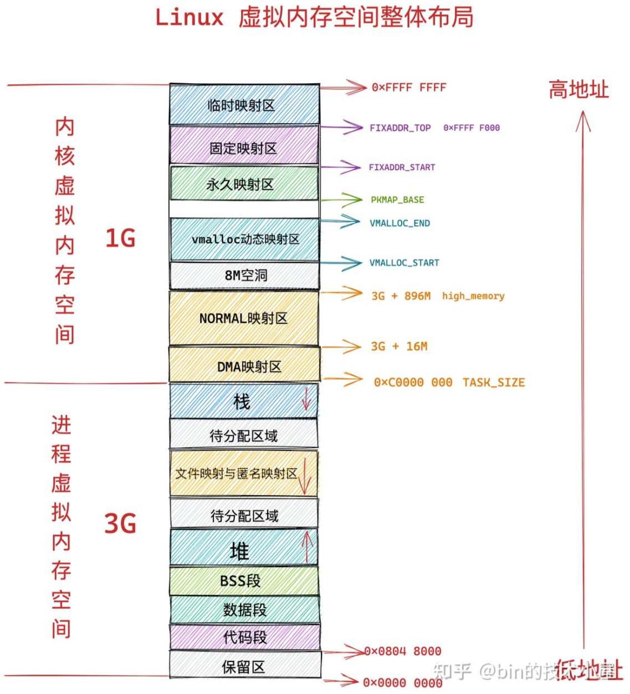

而在64位下，内核的虚拟内存空间就变的大多了，也不用扣扣嗖嗖

所以由于虚拟空间足够大，即使内核要访问全部的物理内存，直接映射就好。

所以64位系统下整个虚拟内存空间布局为： 

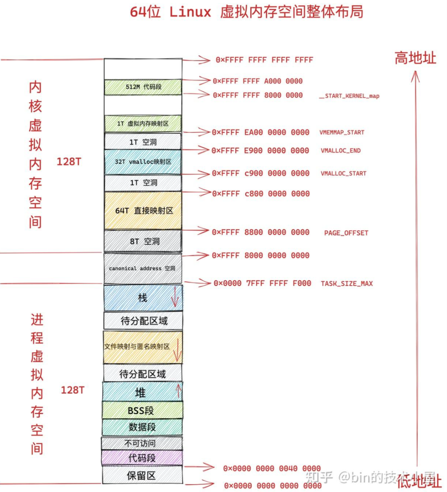

