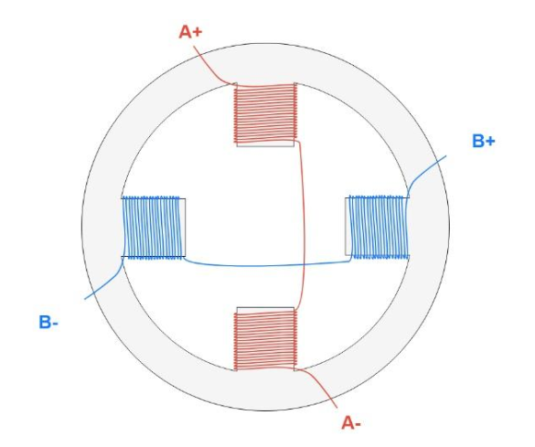

回顾：
在无刷电机的FOC控制里，其核心思想是"解耦"，利用数学中的坐标变换，将三相坐标系下电机电流转换到交轴Iq与直轴Id,再通过设计控制器如PID,ADRC等方法对电机完成控制。而步进电机，其本质也可以理解为一种两相的无刷电机，因此，可以借鉴三相无刷电机的FOC控制，实现步进电机的精准控制。
## 步进电机模型

对于常见的步进电机控制方法，也就是脉冲控制，指的是输入一个脉冲，电机转子就步进一下，所以在这种控制方法下，输出的角度和脉冲数有关，成正比，而转速则和脉冲的频率有关。对于此次使用的两相四线步进电机，有四根线，电机可以简化成一下模型：

  

