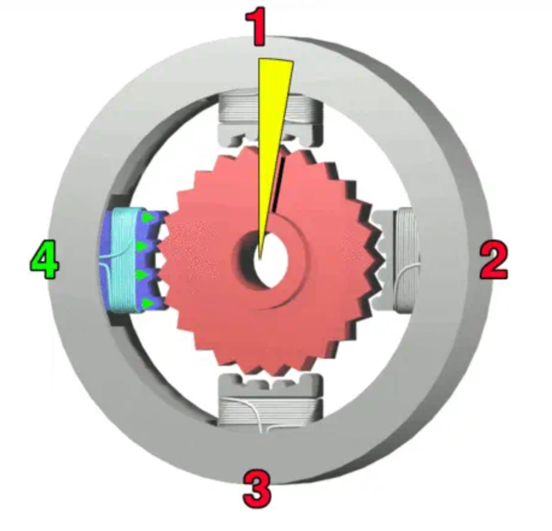
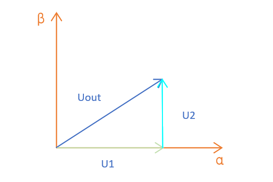

回顾：
在无刷电机的FOC控制里，其核心思想是"解耦"，利用数学中的坐标变换，将三相坐标系下电机电流转换到交轴Iq与直轴Id,再通过设计控制器如PID,ADRC等方法对电机完成控制。而步进电机，其本质也可以理解为一种两相的无刷电机，因此，可以借鉴三相无刷电机的FOC控制，实现步进电机的精准控制。
## 步进电机模型

对于常见的步进电机控制方法，也就是脉冲控制，指的是输入一个脉冲，电机转子就步进一下，所以在这种控制方法下，输出的角度和脉冲数有关，成正比，而转速则和脉冲的频率有关。对于此次使用的两相四线步进电机，有四根线，电机可以简化成一下模型：

通俗来理解，就是当电流从A+流入，A-流出时，产生了一个N-S磁极，吸引中间的转子转动，接着换B+流入B-流出，产生另一对磁极，不断吸引转子转动。而在此过程中，衍生出很多控制方式，对于现在成本较高的，也就是混合式步进电机，大概是这样：  

转子是带齿冠的，因此分辨率更高，通常都是1.8°的步距角，也就是转一圈200个脉冲。我们要控制的也是这种电机。

## foc控制

### clark变换
经过BLDC的FOC控制，可以知道核心的一部分就是通过坐标变换，也就是先使用clark变换将三个相位相差120°的正弦信号转换到α-β两相坐标系下，这一步也很简单，就是：
$$
\left \{\begin{aligned}I_{\beta} &= \sin\frac{2\pi}{3} I_{b} - \sin\frac{2\pi}{3} I_{c} \\I_{\alpha} &= I_{a} + \cos\frac{2\pi}{3} I_{b} + \cos\frac{2\pi}{3} I_{c}\end{aligned}\right.
$$

而我们的步进本身就是两相直角坐标系，因此，反而是省去了clark变换这一步。

### park变换
对于park变化，和bldc时一致，也就是把两相静止的α-β坐标转换到随转子θ旋转的qd轴上，也是比较简单的数学变换：
$$
\left \{\begin{aligned}I_{d} &= \cos(\theta) I_{\alpha } + \sin(\theta) I_{\beta} \\I_{q} &= -\sin(\theta) I_{\alpha } + \cos(\theta) I_{\beta}\end{aligned}\right.
$$

## SVPWM
除了基础的数学变换,另一个关键的部分就是SVPWM的计算过程,这一块需要和BLDC的SVPWM计算过程调整一下。
由于步进电机两个线圈之间没有连接,因此需要两个H桥来控制AB相,先画出逆变示意图:

如果我们记:
$$
S_{x} = \left \{\begin{aligned}1-上桥臂连通，下桥臂断开 \\0-上桥臂断开，下桥臂连通\end{aligned}\right.
$$

对于BLDC的三相全桥逆变,一共有$$2^{3}%=$$个基础矢量，而步进这里有四个全桥，也就是有$$2^{4}$$个基础矢量，

以一种情况为例:如A+的上桥臂连通,下桥臂断开,A-、B+、B-相的上桥臂断开，下桥臂断开，此时，也就是$$S_{a+} = 1,S_{a-} = 0,S_{b+} =0,S_{b-} = 0$$,
此时$$U_{A+} = U_{dc}$$,以此类推，得到：
| $$S_{a+}$$ | $$S_{a-}$$ | $$S_{b+}$$ | $$S_{b-}$$  | $$U_{\alpha}$$ | $$U_{\beta}$$ | 模长|
| :-----:| :------: | :-----: | :-----:| :------: | :-----: | :-----: |
| 0 | 0 | 0 | 0 | 0 | 0 | 0|
| 0 | 0 | 0 | 1 | 0 | -$$U_{dc}$$ | $$U_{dc}$$|
| 0 | 0 | 1 | 0 | 0 | $$U_{dc}$$ |$$U_{dc}$$|
| 0 | 1 | 0 | 0 | -$$U_{dc}$$ | 0 |$$U_{dc}$$|
| 0 | 0 | 1 | 1 | 0 | 0 |0|
| 0 | 1 | 0 | 1 | -$$U_{dc}$$ |-$$U_{dc}$$ |$$\sqrt{2}U_{dc}$$|
| 0 | 1 | 1 | 1 | -$$U_{dc}$$ | 0 |$$U_{dc}$$|
| 0 | 1 | 1 | 0 | -$$U_{dc}$$ | $$U_{dc}$$ |$$\sqrt{2}U_{dc}$$|
| 1 | 0 | 0 | 0 | $$U_{dc}$$ | 0 |0 |$$U_{dc}$$|
| 1 | 1 | 0 | 0 | 0 | 0 |0|
| 1 | 0 | 1 | 0 | $$U_{dc}$$ | $$U_{dc}$$ |$$\sqrt{2}U_{dc}$$|
| 1 | 0 | 0 | 1 | $$U_{dc}$$| -$$U_{dc}$$ |$$\sqrt{2}U_{dc}$$|
| 1 | 0 | 1 | 1 | $$U_{dc}$$ | 0 |$$U_{dc}$$|
| 1 | 1 | 1 | 0 | 0 | $$U_{dc}$$ |$$U_{dc}$$|
| 1 | 1 | 0 | 1 | 0 | -$$U_{dc}$$ |$$U_{dc}$$|
| 1 | 1 | 1 | 1 | 0 | 0 |0|

并画出16个矢量的矢量圆图：

最终将矢量圆分为了四个扇区：

以扇区1为例：  

记T为总时长，$$T_{0}$$为零矢量时间，$$T_{1}$$为在α轴上($$U_{0}$$)上的作用时间，$$T_{2}$$为在β轴上($$U_{90}$$)上的作用时间，所以  

$$T = T_{0} + T_{1} + T_{2}$$  
$$U_{2} = (T_{2}/T) U_{90}$$  
$$U_{1} = (T_{1}/T) U_{90}$$
也就是：

$$
\left \{\begin{aligned}U_{\alpha} &= \frac{T_{1}}{T}|U_{0}| \\U_{\beta} &= \frac{T_{2}}{T}|U_{90}|\end{aligned}\right.
$$

同时为了保证幅值不变原则，需要使$$ |U_{0}| = |U_{90}| = \sqrt{2}U_{dc}$$

因此，容易得出四个扇区各个矢量占空比关系：

| 扇区 | I | II | III  | IV |
| :-----:| :------: | :-----: | :-----:| :------: |
| $$T_{b}$$| $$\frac{\sqrt{2}}{2}U_{\beta}$$ | $$\frac{\sqrt{2}}{2}U_{\beta}$$ | -$$\frac{\sqrt{2}}{2}U_{\beta}$$| -$$\frac{\sqrt{2}}{2}U_{\beta}$$ |
| $$T_{a}$$| $$\frac{\sqrt{2}}{2}U_{\alpha}$$ | -$$\frac{\sqrt{2}}{2}U_{\alpha}$$ | -$$\frac{\sqrt{2}}{2}U_{\alpha}$$| $$\frac{\sqrt{2}}{2}U_{\alpha}$$ |

使用N=2*b+a+1来计算扇区:

| 扇区 | b | a | N  |
| :-----:| :------: | :-----: | :-----:|
|1|1|1|4|
|2|1|0|3|
|3|0|0|1|
|4|0|1|2|

 ## Simulation
 所以大致思路就是对电机获得的αβ电流以及转子θ角度，park变换得到dq电流，对dq电流进行控制，将输出的dq电压进行反park变换,得到应输出的αβ电压，送入svpwm计算，最终给硬件全桥，来控制电机。接下来就来搭建simulation过程，使用matlab的simulink工具
