## 简介

USB是一种支持热插拔的高速串行传输总线。使用差分信号来传输。USB支持“总线供电”和“自供电”两种模式，在总线供电下，设备最多可以获得500mA的电流。
在一条USB总线上，可达到的最高传输速度等级由该总线上最慢的设备来决定。这里的设备指的是HOST、HUB及一些USB功能设备。

USB体系包括：主机、设备以及物理连接三个部分。
- 其中主机是一个提供USB接口和接口管理能力的硬件、软件及固件的复合体。在一个USB系统里只有一个主机。
- 而设备包括USB功能设备和USB HUB，最多支持127个设备
- 物理连接是USB的传输线，USB2.0系统，要求使用屏蔽的双绞线。

其中，一个USB HOST最多同时支持128个地址，但地址0作为默认地址，只在设备枚举期间临时使用，不能被分配给任何一个设备。所以一个USB HOST最多同时支持127个地址。如果一个设备占用一个地址，那么也就是最多支持127个设备。在实际的USB系统里，要连接127个，就得使用HUB了，而USB HUB也是要占用地址的，因此，实际上可使用的USB功能设备肯定是小于127个的。

USB体系使用分层的星型拓扑来连接所有的USB设备，如下图:
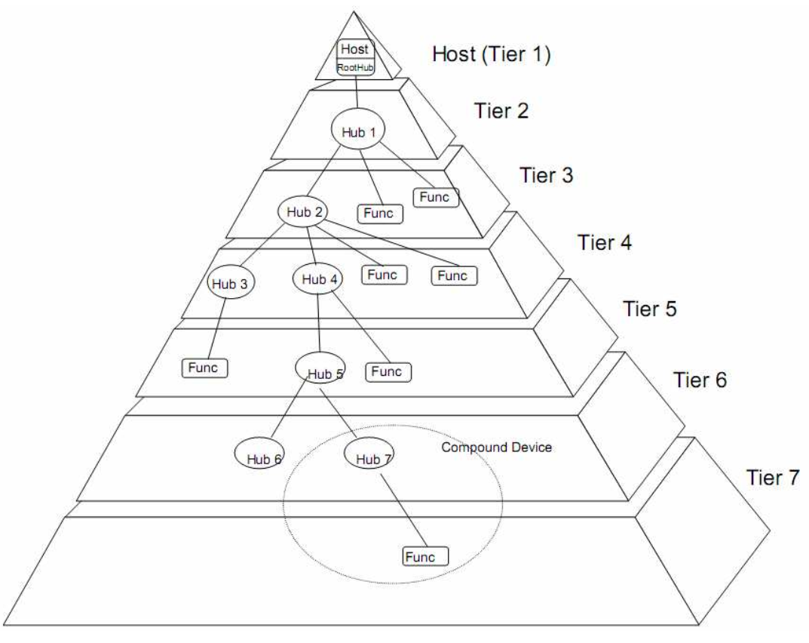
以HOST-ROOT HUB为起点，最多支持7层(Tier),也就是任何一个USB系统中最多允许5个USB HUB的级联。

ROOT HUB 是一个特殊的USB HUB ，他集成在主机控制器里，不占用地址。
而复合设备(Compound Device)可以占用多个地址，复合设备就是把多个功能设备通过内置的HUB组合，比如又有音频又有摄像头的USB设备。

USB采用轮询的广播机制传输数据，所有传输均由主机发起。任何时刻整个USB系统仅允许一个数据包的传输。即不同的物理传输线上看到的数据包都是被同一个被广播的数据包

USB采用“令牌包”-“数据包”-“握手包”的传输机制。在令牌包中指定数据包的去向或者来源的设备地址和端点(endpoint)，从而保证了只有一个设备对被广播的数据包/令牌包做出响应。握手包表示了传输的成功与否。  
其中：
- 数据包：USB总线上数据传输的最小单位，包括SYNC，数据和EOP三部分。其中数据的格式针对不同的包有不同的格式。但都是以8位的PID开始，PID指定了数据包的类型(共16种)。令牌包及指PID为IN/OUT/SETUP的包。

*PID包(packet identifier),也就是包标识符，16种如下*  

1. 令牌包：  
    - OUT(0001): 主机发送数据到USB设备
    - IN(1001):  主机接受从USB设备发出的数据
    - SOF(0101): 帧或者小帧的开始信息
    - SETUP(1101): 主机想USB设备发送配置信息

2. 数据包：
    - DATA0(0011): 数据包为偶数据包
    - DATA1(1011): 数据包为奇数据包
    - DATA2(0111): 高速同步事务专用数据包
    - MDATA(1111): SPLIT事务专用数据包

3. 握手包：
    - ACK(0010): 数据已经被接收方正确接受
    - NAK(1010): 数据未被接收方正确接受
    - STALL(1110): 使用的端点被挂起
    - NYET(0110): 接收方没有反应

4. 特殊包：
    - PRE(1100): 低速数据的先导包
    - ERR(0100): SPLIT事务中表示出现错误
    - SPLIT(1000): 高速模式下用于解决从高速模式到低速和全速模式的转换
    - PING(0100): 仅用于高速模式下主机使用该事务判断设备是否可以接收数据

- 端点：是USB设备中可以进行数据收发的最小单元，支持单向和双向的数据传输。设备支持端点的数量是有限制的，除了默认端点外，低速设备最多支持2组(2个输入两个输出)，高速和全速设备最多支持15组 

管道(Pipe)是主机和设备端点之间数据传输的模型。共有两种类型的管道：无格式的流管道和有格式的信息管道。任何一个USB设备一旦上电就存在一个信息管道，也就是默认的控制管道。USB主机通过该管道来获取设备的描述、配置、状态，并对设备进行配置。

USB设备连接到HOST时，HOST必须通过默认的控制管道对其进行枚举，完成获得其设备描述、进行地址分配、获得其配置描述、进行配置等操作。USB的即插即用特性就依赖于这个规则。

- 枚举：是USB系统中很重要的一个动作。是由一系列标准请求组成(若设备属于某个子类，则还包含对该子类定义的特殊请求)。通过枚举HOST可以获得设备的基本描述信息，如支持的USB版本，PID，VID、设备分类、供电方式、最大消耗电流、配置数量、各种类型端点的数据和传输能力、最大包长度。HOST通过PID和VID加载设备驱动程序，对设备进行合适的配置，只有经过枚举的设备才能正常使用。

USB系统定义了四种类型的传输：  
1. 控制传输：主要用于在设备连接时对设备进行枚举。  
2. 中断传输：用于对延时要求严格，小量数据的可靠传输，如键盘、手柄等
3. 批量传输：用于对延时要求宽松，大量数据的可靠传输，如U盘
4. 同步传输：用于对可靠性要求不高的实时数据传输如摄像头，音响。

_注意：中断传输并不意味着传输中，设备会先中断HOST，中断传输也是由HOST发起的，采用轮询的方式询问设备是否有数据发送，若有则传输，若无则NAK主机。_

不同的传输类型在物理上并没有太大区别，只是在传输机制、主机安排传输任务、可占用USB带宽的限制以及最大包长度有一定的差异。  
USB设备通过管道和HOST通信，在默认控制管道上接收并处理以下三种类型的请求：

1. 标准请求：一共有11个标准请求，如得到设备描述、设置地址、得到配置描述等。所有的USB设备都要支持这些请求，HOST通过标准请求来识别和配置设备。

2. 类请求：USB定义了若干个子类，如HUB类，大容量存储器类等。不同的类定义了不同的若干类请求，类设备要支持相应的类请求，设备所属的类可以在设备描述符中得到。

3. 厂商请求，这部分是设备生产厂商为实现一定的功能而自己定义的。

### USB HUB
USB HUB提供了一种低成本、低复杂度的USB接口扩展方法。HUB的上行PORT面向HOST，下行PORT面向设备。在下行PORT中，HUB提供了设备连接检测和设备移除检测的能力，并给下行PORT供电。HUB可以单独使能各下行PORT，不同的PORT可以工作在不同的速度等级(高速/全速/低速)

HUB 由HUB重发器(HUB Repeater)、HUB转发器(HUB Transaction Translator)以及HUB控制器(HUB Controller)三部分组成。  

- HUB Repeater：是上行PORT和下行PORT之间的一个协议控制开关，负责高速数据包的重生与分发。重生与分发指的是HUB Repeater需要识别从上行/下行PORT上接收到的数据，并分发到下行/上行PORT。所谓分发主要是指从上行PORT接收到数据包需要向所有使能的高速下行PORT发送，也就是广播

- HUB Transaction Translator：转发器提供了从高速/全速/低速通讯的转换能力，通过HUB可以在高速HOST和全速/低速设备之间匹配。

- HUB Controller：控制器负责和HOST通信，HOST通过HUB类请求和HUB控制器通讯，获得关于HUB本身和下行PORT的HUB描述符，进行HUB和下行PORT的监控和管理。

## 数据流模型

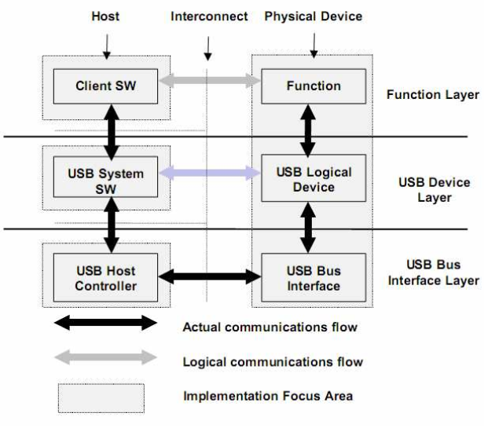

图中黑色箭头表示真实的数据流，灰色箭头表示逻辑上的通信。

在HOST端，应用软件(client sw)不能直接访问USB总线，必须通过USB系统软件和USB HOST控制器来访问USB总线。在USB总线上和USB设备进行通信。

从逻辑上可以分为功能层、设备层、和总线接口层三个层次。
- 功能层完成功能级的描述、定义和行为
- 设备层完成从功能级到传输级的转换，把一次功能级的行为转换为一次基本传输。
总线接口层处理总线上的Bit流，完成数据传输的物理实现和总线管理。

物理上，USB设备通过分层的星型总线，连接到HOST，但在逻辑上HUB是透明的，各个USB设备是直接和HOST连接，和HOST上的应用软件形成一对一的关系。如下:
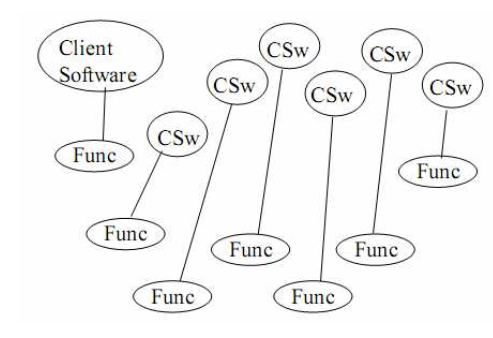  

各个应用软件(Client software/C-SW)和功能设备之间的通信相互独立，应用软件通过USB设备驱动程序(USBD)发起IRQ请求，请求数据传输。HOST控制器驱动程序(HCD)接收IRQ请求，并解析称为USB传输和传输事务，并对USB系统中所有的传输事务进行任务排定(因为可能存在多个应用软件发起IRQ请求)。主机控制器执行排定的传输任务。在同一条共享的USB总线上进行数据包的传输。
也就是：  
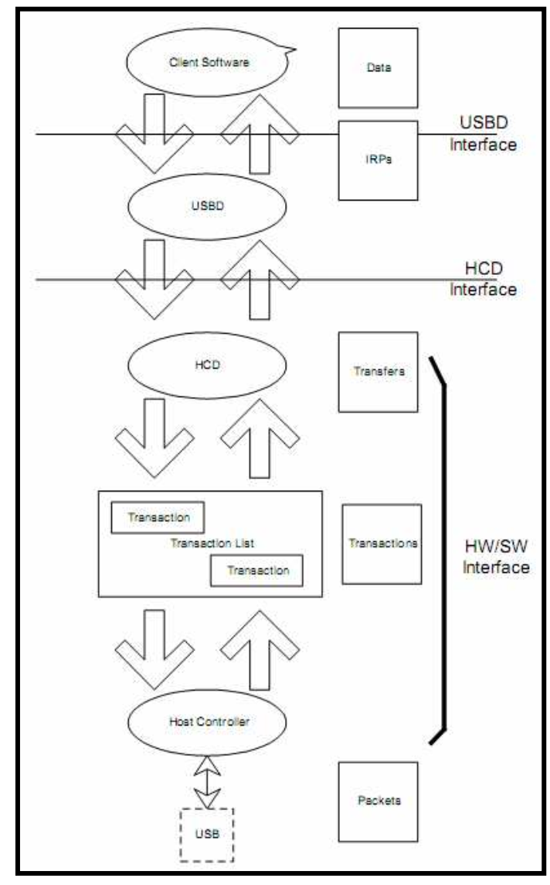

USB中数据的传输，宏观上看是HOST和USB功能设备之间进行的，微观看则是应用软件的buffer和USB功能设备的端点之间进行的。

一般来说端点都有Buffer，可以认为USB通信就是应用软件的buffer和设备端点的buffer之间数据交换。交换的通道叫做管道。应用软件和设备之间的数据交换来完成设备的控制和数据传输。通常需要多个管道来完成数据交换，因为同一管道只支持一种类型的数据传输。用在一起来对设备进行控制的若干个管道称为设备的接口。

一个USB设备可以包括若干个端点，不同的端点以端点编号和方向区分。不同的端点可以支持不同的传输类型、访问间隔以及最大数据包大小，除端点0外，所有的端点只支持一个方向的数据传输。端点0是一个特殊的端点，支持双向的控制传输。

### 四种传输类型
#### 控制传输
控制传输是一种可靠的双向传输，一次控制传输可以分为三个阶段  
1. 从HOST到Device的SETUP事务传输，这个阶段指定了此次传输的请求类型
2. 数据阶段，也有一些请求没有数据阶段
3. 状态阶段，通过一次IN/OUT传输表明请求是否成功完成

控制传输通过控制管道在C-SW和Device的控制端点之间进行。控制传输过程中的传输的数据是有格式定义的，USB设备或主机可根据格式定义解析获得的数据含义，其他三种传输类型都没有格式定义。

控制传输对于最大包长度有固定的要求：
- 高速设备： 64Byte
- 低速设备： 8Byte
- 全速设备： 可以是8/16/32/64

#### 中断传输
中断传输是一种轮询的传输方式，是一种单向的传输。HOST通过固定的间隔对中断端点进行查询，若有数据传输或可以接收数据则返回数据或发送数据，否则返回NAK，表示未准备好。

中断传输的延迟有保证，但并非实时传输。是一种延迟有限的可靠传输，支持错误重传。

对于高速/全速/低速端点，最大包长度可以分别达到1024/64/8Bytes

高速中断传输不得占用超过80%的微帧时间，全速和低速不得超过90%

中断端点的轮询间隔在端点描述符中定义。

#### 批量传输
批量传输是一种可靠的单向传输，但延迟没有抱着呢个，他尽量利用可以利用的带宽来完成传输，适合数据量较大的传输。

低速USB设备不支持批量传输，高速批量端点的最大包长度为512，全速批量端点的最大包长度可以是8/16/32/64。

批量传输在访问USB总线时，相对其他传输类型，具有最低优先级，USB HOST总是优先安排其他类型的传输，当总线带宽有富裕时才安排批量传输。

高速的批量端点必须支持PING操作，向主机报告端点状态，NYET表示否定应答，没有准备好接收下一个数据包，ACK表示肯定应答，已经准备好接收下一个数据包。

#### 同步传输
同步传输是一种实时的，不可靠的传输，不支持错误重发。只有高速和全速端点支持同步传输。高速同步端点最大包长度为1024，低速为0123.

除了高速高带宽同步端点外，一个微帧内仅允许一次同步事务传输，高速高带宽端点最多可以在一个微帧内进行三次同步事务传输，传输高达3072字节的数据。

## 协议层规范
USB采用小端，在总线上先传输一个字节的最低有效位，最后传输最高有效位，采用NRZI编码，若遇到连续的6个1要求进行位填充，即插入一个0.

所有的USB包都从SYNC开始，高速包的SYNC宽度位32bit，全速/低速包的SYNC是8bit，实际接收到的SYNC长度由于有USB HUB的关系，可能会小于这个值。

USB数据包格式：
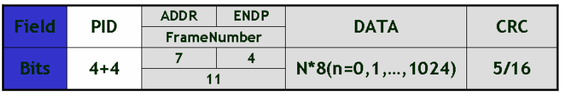

- PID表示该包的类型，上面有介绍。
- 对于令牌包来说：PID后面是7位的地址和4位的端点号，没有数据域，以5位的CRC校验结束。SOF是一类特殊的令牌包，PID后面跟的是11位帧编号。

- 对于数据包来说，PID后面直接跟数据域，长度是N字节。数据域后面跟16位CRC校验。

- 握手包只有PID域，没有数据域和校验。

- 特殊的，在分离传输中，有一类特殊的包，叫做Start-Split和Complete-Split包。

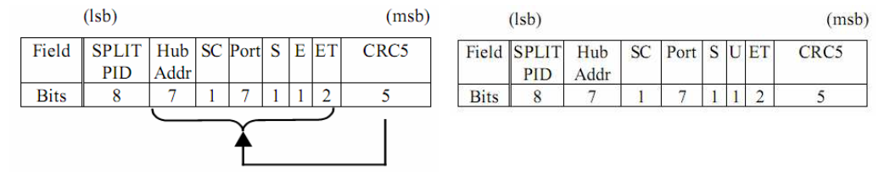  

主要是用来指定HUB的地址和下行PORT以及端点类型，以及此次传输中数据包在整个数据中的位置。

数据在USB总线上传输以包为单位，包只能在帧内传输，高速USB总线的帧周期为125us，全速以及低速USB总线的帧周期为1ms，帧的起始由一个特定的包(SOF)表示，帧尾由EOF表示，EOF并不是一个包，而是一个电平状态，EOF期间不允许存在数据传输。

### 事务传输流程
每个事务通常由三个阶段组成：
1. 令牌阶段Token Phase
2. 数据阶段Data Phase
3. 响应阶段Ack Phase

#### 批量传输

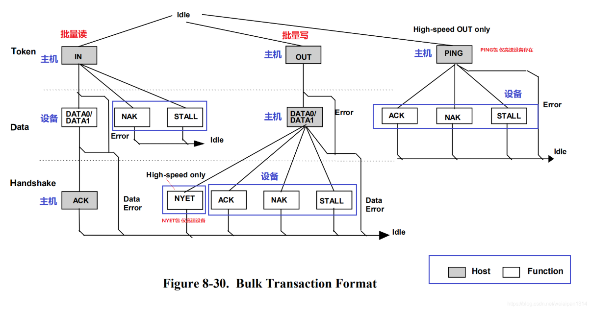

图中灰色的包表示主机发出，白色的包表示设备发出。

批量传输由一个或多个批量事务组成。每一个批量事务都具有令牌包、数据包、握手包。

批量事务有一个特性是能通过错误检测和重试来保证主机和设备之间没有错误传递。所以：

1. 当主机准备接收批量数据时，主机发出IN令牌，设备端点通过返回数据包或者NAK或者STALL来响应。NAK表示设备暂时无法返回数据，STALL 表示端点永久停止。如果主机收到一个有效的数据包，用ACK来响应设备，如果接收数据时有错误，则不会返回握手包。

2. 当主机准备发送批量数据时，主机发出一个OUT令牌包，然后是一个数据包，如果设备接收数据没有错误，则设备会返回三个或者四个还有高速操作下的NYET的握手包中的其中一个。
    - ACK:表示没有错误，并通知主机可以进行下一个数据包
    - NAK:表示接收数据没有错误，但是主机应该重新发送数据，因为设备可能处于临时条件拒绝接收数据如缓冲区满
    - STALL:如果端点被停止，则返回STALL表示主机不应该重试传输，表示设备可能存在错误
    - NYET:只用在高速设备中，表示设备没有准备好数据
    - ERR：如果收到的数据带有CRC错误，则不返回握手

3. PING令牌包只用于高速设备，主机用来查询设备当前的状态。

##### 正确数据传输同步原理
首先假设主机和设备状态都是0.  
主机会根据当前状态先大宋DATA0类型数据包给设备，当设备正确收到数据包后会把自己状态反转，变成1，并给主机一个应答包，主机也把自己状态切换为0.

如果还需要发送数据包，则主机会发送DATA1数据包，当设备收到正确数据包后会再次反转状态为0，并给主机应答，当主机正确接收到应答包后对自己状态进行反转

##### 重传机制
假设发送数据前，主机和设备状态都是0。  
主机先发送DATA0类型的数据包给设备，当设备发现数据有问题，不会对自己状态进行反转，并给主机发送非应答数据包，主机收到的非应答数据包，主机也不切换自己状态，主机会在适当的时候重新发送DATA0，知道设备接收正常。

##### 应答包故障的传输
首先在发送数据之前，主机和设备的状态都是0.  
主机先发送DATA0，设备接收正确后将自己状态反转为1，并给主机一个应答包，这个时候主机收到了故障的应答包，并不会对自己状态反转。

然后主机在适当的时候又重新发了DATA0，这个时候设备状态是1，主机状态是0，设备会直接忽略这个包，并保持状态，然后设备会重新给主机发一个应答包，主机接收正确后会反转自己状态。

继续发送时，主机状态这个时候是1，则发送DATA1数据包，设备接收正确后，反转自己状态，并再给主机发应答包。

##### 抓包分析

#### 控制传输

一次控制传输分为3或2个阶段：建立(setup)、数据(data)(可能没有)、状态(status)。每个阶段都由一次或多次的事务传输组成。

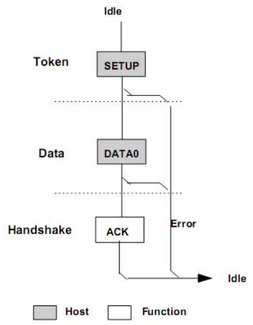  

对于上图建立阶段，是由主机发起的，开始于一个SETUP令牌包，然后紧跟一个DATA0数据包。

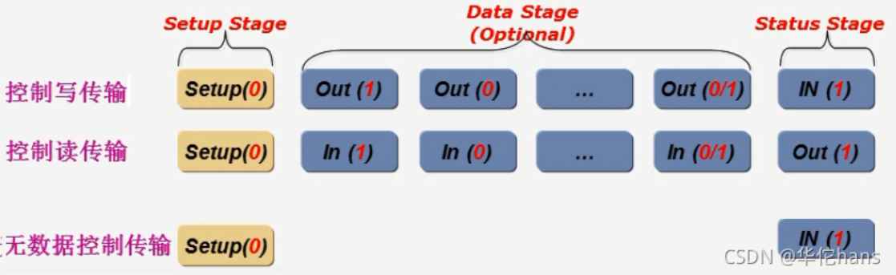

##### 控制传输读
1. 在读事务中，为OUT事务，数据过程中第一包必须是DATA1，然后后面就也同样由PID反转来DATA0-DATA1-DATA0.....

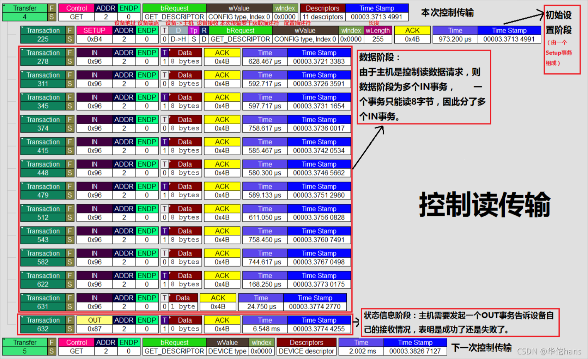

可以看到，先发起了一个SETUP，由一个SETUP事务开始，包含了设备地址，设备端点，方向是设备到主机，设备接收，请求获得描述符，配置描述符，数据长度255。然后数据阶段里，都是IN事务，读完以后，主机发起了一个OUT事务 ，告诉设备自己接收情况。

##### 控制传输写

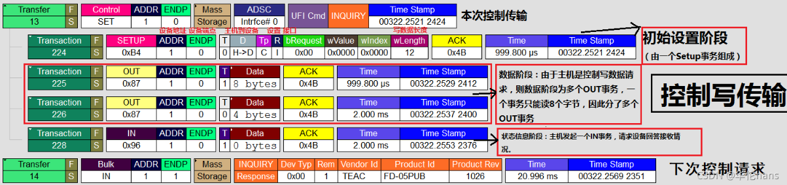

控制传输写也是由主机发起一个SETUP事务，数据长度12，然后主机发起OUT事务，并把数据写出去，最后主机发起一个IN事务，来接收设备的应答情况。

#### 中断传输

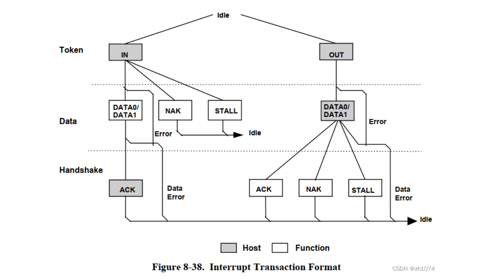

中断传输和其他传输也差不多，区别在于事务传输发生的端点不同，支持的包最大长度不同等等，主机在排定中断传输任务时，会根据对应中断端点描述符中指定的查询间隔发起中断传输，中断传输有较高优先级，仅次于同步传输。

中断传输也同样使用PID反转的机制来保证收发端数据同步

##### 中断传输 IN
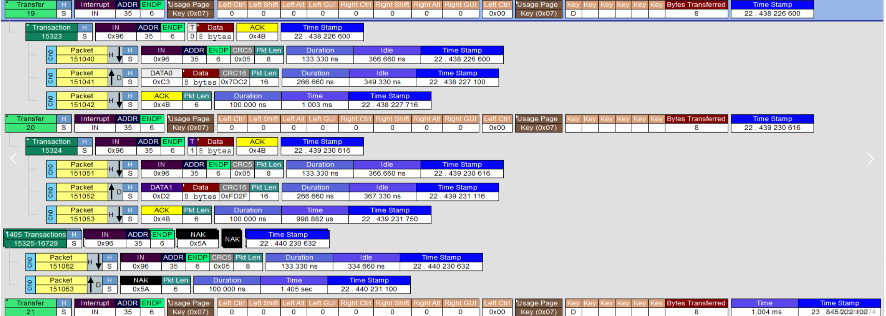

可以看到中断传输会发起一个IN事务，然后主机发起一个IN令牌包，设备向主机发起DATA数据包，然后主机再回应一个握手包。

##### 中断传输OUT
写和读就是相反的，主机使用OUT令牌包

#### 同步传输

同步传输比较特殊，传输单位不再是事务，而是按照令牌包+数据包的形式，因此带宽要求很高，并且无需PID反转。所以是不可靠的

### 总结：

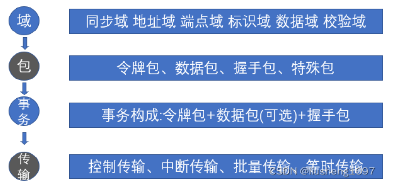

#### 传输：USB发起数据传输的过程，共四种：
- 控制传输
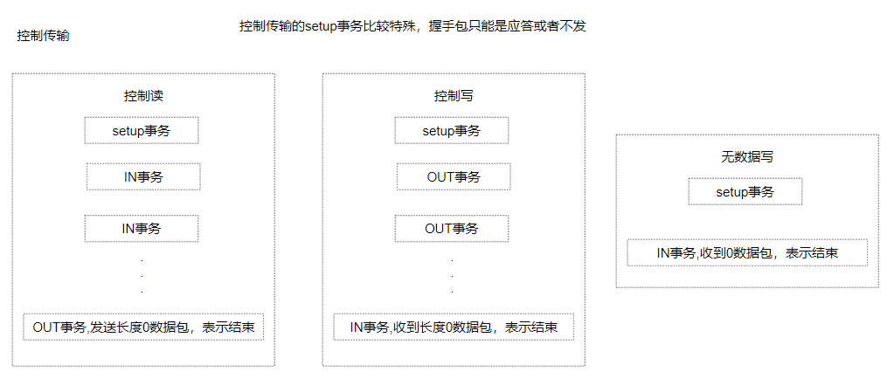
- 中断传输
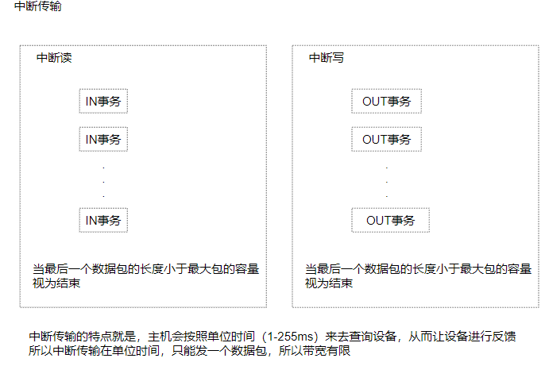
- 批量传输
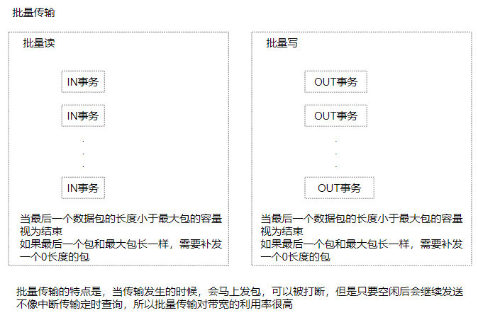
- 同步传输
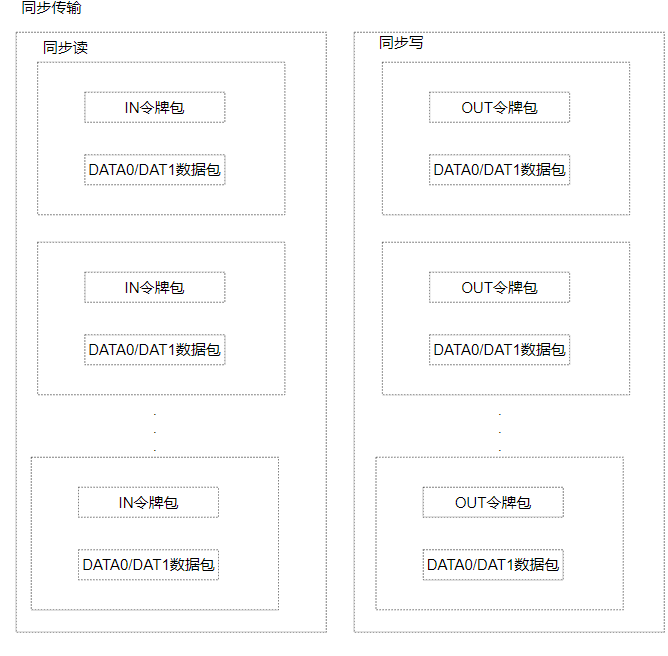

#### 事务：处理的基本过程，一个传输由一个或多个事务构成
- SETUP事务
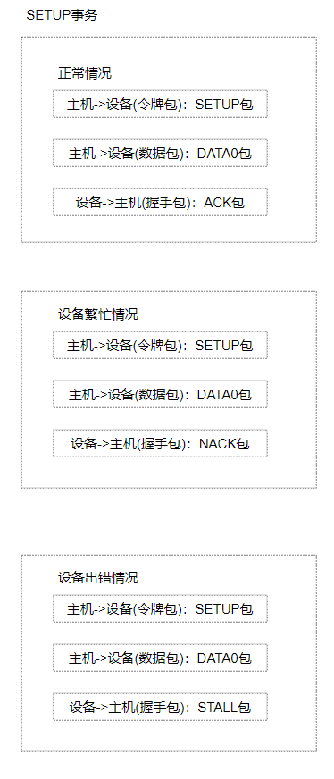
- IN事务
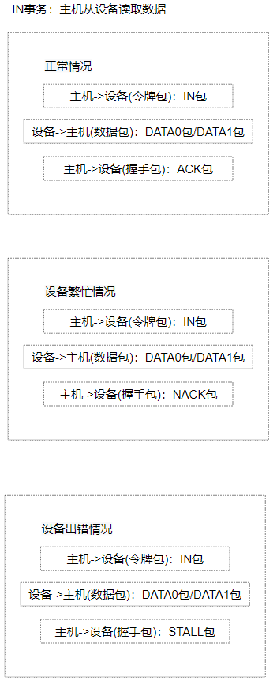
- OUT事务
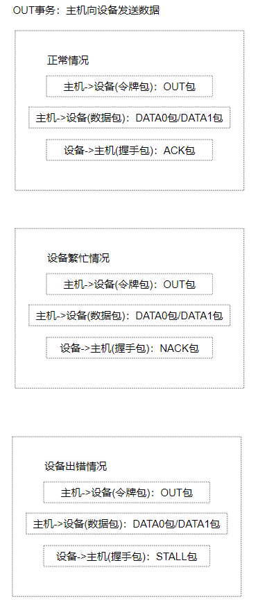

#### 包：基本传输单位，每个事务由多个包组成。所有的数据都是经过打包后在总线上传输的。
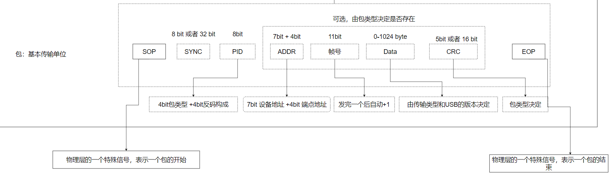  

包类型：
- 令牌包
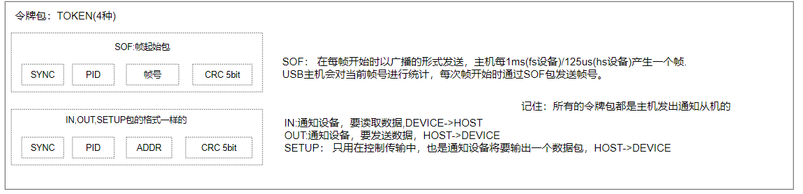

- 数据包
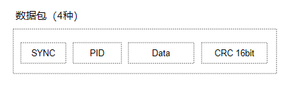

- 握手包
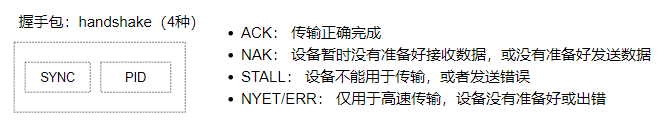

## HID
HID是一种用于人机交互的协议，定义了人体接口设备，比如什么键盘、鼠标、手柄之类的。

USB的主机是通过各种描述符来识别各种各样的设备的，有设备描述符、端点描述符等等。一般来说，主机先获取设备描述符，
然后配置设备描述符，对于HID设备，主机还需要获得HID描述符和报表描述符。

其中标准的USB设备共有五种描述符：
- 设备描述符
- 配置描述符
- 接口描述符
- 端点描述符
- 字符串描述符

对于HID设备还有：
- HID报告描述符
- HID物理描述符(可选)

### 设备描述符
一个设备只有一个设备描述符，设备描述符包括厂商ID和产品ID以及一些协议。
| 名称               | 字节大小 | 说明                             |
|--------------------|----------|----------------------------------|
| bLength            | 1        | 描述符长度（18字节）             |
| bDescriptorType    | 1        | 描述符类型（设备描述符为0x01）   |
| bcdUSB             | 2        | 设备使用的USB协议版本            |
| bDeviceClass       | 1        | 类代码                           |
| bDeviceSubClass    | 1        | 子类代码                         |
| bDeviceProtocol    | 1        | 设备使用的协议                   |
| bMaxPacketSize0    | 1        | 端点0最大包长                    |
| idVendor           | 2        | 厂商ID                           |
| idProduct          | 2        | 产品ID                           |
| bcdDevice          | 2        | 设备版本号                       |
| iManufacturer      | 1        | 描述厂商的字符串的索引           |
| iProduct           | 1        | 描述产品的字符串的索引           |
| iSerialNumber      | 1        | 产品序列号字符串的索引           |
| bNumConfigurations  | 1        | 可能的配置数                     |

### 配置描述符
定义了设备的配置信息，一个设备可以有多个配置描述符，配置描述符描述了该配置的接口数、供电模式之类的。

| 名称                | 字节大小 | 说明                                       |
|---------------------|----------|--------------------------------------------|
| bLength             | 1        | 该描述符字节数长度（9字节）                 |
| bDescriptorType     | 1        | 描述符类型（配置描述符为0x02）             |
| wTotalLength        | 2        | 此配置信息的总长度，（包括配置，接口，端点和设备类及厂商定义的描述符） |
| bNumInterfaces      | 1        | 该配置所支持的接口个数                     |
| bConfigurationValue | 1        | 在SetConfiguration()请求中用做参数来选定此配置 |
| iConfiguration      | 1        | 描述此配置的字串描述表索引                 |
| bmAttributes        | 1        | 配置特性                                   |
| MaxPower            | 1        | 在此配置下的总线电源耗费量 2mA为一个单位   |

### 接口描述符
描述了该接口的端点数量，子类代码之类的，一个设备可以有多个接口描述符
| 名称                 | 字节大小 | 说明                                       |
|----------------------|----------|--------------------------------------------|
| bLength              | 1        | 该描述符字节数长度（9字节）                 |
| bDescriptorType      | 1        | 描述符类型（接口描述符为0x04）             |
| bInterfaceNumber     | 1        | 接口编号，当前配置支持的接口数组索引       |
| bAlternateSetting    | 1        | 可选设置的索引值                           |
| bNumEndpoints        | 1        | 此接口用的端点数量                         |
| bInterfaceClass      | 1        | 接口所属的类值                             |
| bInterfaceSubClass   | 1        | 子类代码                                   |
| bInterfaceProtocol   | 1        | 接口协议                                   |
| iInterface           | 1        | 描述此接口的字串描述表的索引值             |

### 端点描述符
每个端点都有端点描述符，主要描述该端点的地址，属性，数据包大小等等。
| 名称                 | 字节大小 | 说明                                       |
|----------------------|----------|--------------------------------------------|
| bLength              | 1        | 该描述符字节数长度（7字节（0x07））        |
| bDescriptorType      | 1        | 描述符类型（接口描述符为0x05）             |
| bEndpointAddress     | 1        | USB设备的端点地址                         |
| bmAttributes         | 1        | 端点属性                                   |
| wMaxPacketSize       | 2        | 本端点接收或发送的最大信息包大小           |
| bInterval            | 1        | 主机查询端点的时间间隔                     |

### 字符串描述符
字符串描述符是可选的。如果不支持字符串描述符，那么设备、配置、接口描述符内所有的字符串描述符索引都要为0
| 名称              | 字节大小 | 说明                             |
|-------------------|----------|----------------------------------|
| bLength           | 1        | 该描述符字节数长度               |
| bDescriptorType   | 1        | 描述符类型（字符串描述符为0x03） |
| bString           | N        | Unicode编码字符串                |

### HID描述符
HID设备其设备描述符里面的bDeviceClass、bDeviceSubClass、bDeviceProtocol应该为0。而接口描述符中bInterfaceClass、bInterfaceSubClass、bInterfaceProtocol三个值应该为：
| 名称（均在接口描述符里） | 值                                                                 |
|--------------------------|--------------------------------------------------------------------|
| bInterfaceClass          | 0x03：表示HID为设备                                                 |
| bInterfaceSubClass       | 0x00: 对无需支持引导的HID设备；0x01: 对支持引导的USB设备（鼠标、键盘）；其他：保留。 |
| bInterfaceProtocol       | 当bInterfaceSubClass为0x00，此值无效。当bInterfaceSubClass为0x01。设置为0x01：键盘接口 ↵ 设置为0x02：鼠标接口 |

HID描述符如下:
| 名称                | 字节大小 | 说明                                                         |
|---------------------|----------|--------------------------------------------------------------|
| bLength             | 1        | 该描述符字节数长度（由下级描述符多少决定）                   |
| bDescriptorType      | 1        | 描述符类型（HID描述符为0x21）                                 |
| bcdHID              | 2        | HID协议版本                                                   |
| bCountryCode        | 1        | 国家代码                                                     |
| bNumDescriptor      | 1        | HID设备支持的下级描述符的数量（也就是HID设备特有的报告描述符和物理描述符的综合） |
| bDescriptorType      | 1        | 下级描述符类型（第一个必须是报告描述符0x22）                 |
| wDescriptorLength   | 2        | 下级描述符的长度                                             |
| ...                 | ...      | （这里会根据下级描述符数量罗列）                             |

### HID报告描述符
报告描述符是比较复杂的，没有固定的长度和表。报告描述符就像是告诉主机，我传输的哪些位代表的都是什么含义，
这样主机收到数据后，可以根据这个来解析数据。并根据Usage来正确处理数据。

