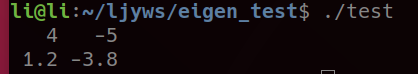

---

## 介绍

Eigen库是C++中的一个开源库，主要用于线性代数的运算，包括有向量运算、矩阵运算等等。由于在机器人控制中应用大量线性代数运算，因此需要掌握eigen库的使用。

## 安装
推荐从源码的方式安装[eigen](http://eigen.tuxfamily.org/index.php?title=Main_Page)库

选择合适的版本下载源码到相应目录并解压得到eigen-x.x.x文件夹
```
cd eigen-x.x.x
mkdir build
cd build 
cmake ..
sudo make install
```


即可完成eigen库的安装

ps: 以上步骤大概率默认将eigen安装在了/usr/local/inculde中的eigen3，然而在很多工程中习惯于调用#include&lt;Eigen/xxx&GT;，而不是#include&lt;eigen3/Eigen/xxx&GT;，因此要将/usr/local/include中的eigen3文件夹复制到上层文件夹即/usr/local/include中，使用：
```
sudo cp -r /usr/local/include/eigen3/Eigen /usr/local/include
```

## 测试
新建一个test.cpp文件并插入代码段
```
#include &lt;iostream&GT;
#include &lt;Eigen/Dense&GT;
using Eigen::MatrixXd;

int main()
{
	MatrixXd m(2,2);
	m(0,0) = 4;
	m(1,0) = 1.2;
	m(0,1) = -5;
	m(1,1) = m(1,0) + m(0,1);
	std::cout << m << std::endl;
}
```

编译
```
g++ test.cpp -o test
```
运行
```
./test
```
得到  


## eigen头文件

|  modules   | header file  | contents |
| :-------- | :--------- | :--------- |
| Core  | #include&lt;Eigen/Core&GT; |Matrix和Array类，基础的线性代数运算 |
| Geometry | #include&lt;Eigen/Geometry&GT; |旋转、平移等变换 |
| LU | #include&lt;Eigen/LU&GT; |求逆、求行列式、LU分解 |
| Cholesky | #include&lt;Eigen/Cholesky&GT; |LLT和LDLT Cholesky分解 |
| Householder | #include&lt;Eigen/Householder&GT; |豪斯霍尔德变换 |
| SVD | #include&lt;Eigen/SVD&GT; |SVD分解 |
| QR | #include&lt;Eigen/QR&GT; |QR分解 |
| Eigenvalues | #include&lt;Eigen/Eigenvalues&GT; |特征值、特征向量分解 |
| Sparse | #include&lt;Eigen/Sparse&GT; |稀疏矩阵的存储和基本线性运算 |
| 稠密矩阵 | #include&lt;Eigen/Dense&GT; |包含了Core、Geometry、LU、Cholesky、SVD、QR、Eigenvalues |
| 矩阵 | #include&lt;Eigen/Eigen&GT; |包含了Dense和Sparse |

因此在使用时，若无严格要求，可以直接#include&lt;Eigen/Dense&GT;或#include&lt;Eigen/Eigen&GT;即可

## 使用
学习可以参考：[官方文档](http://eigen.tuxfamily.org/dox/)，或参考CSDN中有许多教程