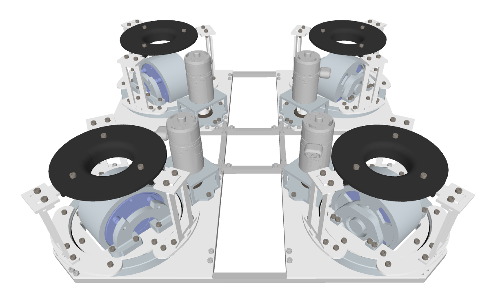

---

## 机械结构

#### 一、整车预览

<iframe
  width="680"
  height="480"
  scrolling="no"
  src="https://3dviewer.net/embed.html#model=https://raw.githubusercontent.com/ljyws/pluto_description/main/pluto.STEP$camera=-43.19207,129.29946,741.14390,138.46685,30.64862,229.99999,0.00000,1.00000,0.00000$envsettings=fishermans_bastion,off$backgroundcolor=255,255,255$defaultcolor=200,200,200$edgesettings=off,0,0,0,1"
></iframe>

> 文件较大 模型加载需很久 如下图示意：

#### 二、全场定位模块